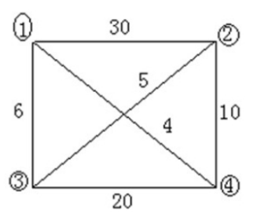

# 实验八

## 问题分析

### 问题与功能描述：

#### 【问题描述】

给定n个城市（从0到n-1），3元组[A, B, C]表示城市A和城市B之间存在道路，且成本为C。计算从0号城市出发，旅行完每个城市一遍，最后回到0号城市的最小成本与路径。如果不存在最优方案，输出-1.

#### 【输入形式】

 第一行有两个数n、m表示n个城市，m条边。

 接下来的m行均为空格隔开的三个整数A B C，表示城市A和B之间的成本为C

#### 【输出形式】

 最小成本

 最小成本对应的路径

### 样例分析1

#### 【样例输入】



 4 6

 0 1 30

 0 2 6

 0 3 4

 1 2 5

 1 3 10

 2 3 20 

#### 【样例输出】

 25

 0 2 1 3 0 （由于系统只支持一个答案，虽然 0 3 1 2 0 也可以，但是不是正确输出，正确答案中优先选择序号小的结点，即第2个结点的序号<倒数第2个结点的序号）

### 样例分析2

#### 【样例输入】

 4 4

 0 1 2

 0 2 6

 1 2 3

 2 3 4 

#### 【样例输出】

 -1

#### 【样例说明】

 输入的图为无向图，最小成本对应的路径优先选择序号小的结点，即第2个结点的序号<倒数第2个结点的序号

## 求解方法

TSP问题，即旅行商问题（Traveling Salesman Problem），是一个经典的组合优化问题。在TSP问题中，假设有一个旅行商需要经过给定的一系列城市，并返回起始城市，要求找到一条最短路径，使得旅行商经过每个城市恰好一次，然后回到起始城市。

TSP问题属于NP-hard问题，没有已知的多项式时间解法，因此常常使用近似算法和启发式算法来求解。

下面是TSP问题的形式化定义：

输入：

- 一组城市，编号从1到n。
- 城市之间的距离或成本矩阵d，其中`d[i][j]`表示城市i到城市j的距离或成本。

目标： 找到一条路径，使得旅行商从起始城市出发，经过每个城市恰好一次，最后回到起始城市，并使得路径的总成本最小。

TSP问题的解决方案通常有两种表示方式：

1. 路径表示：用一个序列表示旅行商经过的城市顺序，例如[1, 3, 2, 4, 1]表示旅行商从城市1出发，依次经过城市3、2、4，最后回到城市1。
2. 邻接矩阵表示：使用一个二维矩阵表示城市之间的距离或成本，其中矩阵元素`d[i][j]`表示城市i到城市j的距离或成本。

TSP问题的求解方法包括：

1. 穷举法：尝试所有可能的路径，并计算每条路径的总成本，选择最小成本的路径作为最优解。但随着城市数量的增加，穷举法的时间复杂度会呈指数增长，不适用于大规模问题。
2. 动态规划法：使用动态规划思想，通过填表的方式逐步计算出各个子问题的最优解，并最终得到全局最优解。但该方法的时间复杂度为O(n^2 * 2^n)，在实践中对于较大规模的问题仍然不够高效。
3. 近似算法：通过一些启发式规则或近似算法，找到一个接近最优解的路径。常用的近似算法包括最小生成树算法（如Prim算法和Kruskal算法）、贪心算法（如Nearest Neighbor算法）和局部搜索算法（如2-opt算法和3-opt算法）等。
4. 遗传算法：借鉴生物进化的思想，使用遗传算子（选择、交叉和变异）对路径进行优化，通过多次迭代逐步改进解的质量。
5. 支持向量机算法：将TSP问题转化为支持向量机的形式，通过支持向量机的求解方法来解决TSP问题。

需要注意的是，TSP问题是一个组合优化问题，求解的时间复杂度通常很高。对于较大规模的问题，往往需要借助高性能计算、并行计算或其他优化技术来提高求解效率。

在这里我们使用回溯法来解决旅行商问题（Traveling Salesman Problem，TSP）。

首先，输入城市的数量和道路的数量。然后根据输入的道路信息，构建了一个邻接矩阵表示城市之间的连接和成本关系。初始时，将最优解bestx和当前解x都设置为城市的顺序编号（从1到n），最优值bestc设置为特定的标记NoEdge，cc设置为0。

接下来，程序调用getmincost函数，传入参数2，表示从城市2开始寻找路径。在getmincost函数中，通过递归回溯的方式搜索所有可能的路径，并更新最优值和最优解。

在getmincost函数中，首先判断是否访问到了最后一个城市（i == n），如果是，则判断是否形成了回路。如果形成了回路，即城市x[n-1]与x[n]连通，以及城市x[n]与x[1]连通，就需要更新最优值和最优解。如果当前值优于最优值，或者bestc还未被初始化（等于NoEdge），则更新bestc为当前值，同时将当前解x复制到最优解bestx中。

如果当前未访问到最后一个城市，就继续搜索下一个城市。对于每个可能的下一个城市（从i到n），检查是否可以进入该城市子树。条件是城市x[i-1]与x[j]连通，并且当前路径长度cc加上城市x[i-1]与x[j]的成本小于最优值bestc，或者bestc还未被初始化。如果满足条件，就交换x[i]和x[j]的值，表示进入下一层搜索，同时更新路径长度cc。

递归调用getmincost函数，进入下一层搜索。完成一次递归后，需要还原路径长度cc和解x的值，以进行下一个可能的城市的搜索。

最终，getmincost函数的执行完成后，得到了最小成本bestc和最优解bestx。

在主函数中，首先检查最优解bestx中的路径是否都存在边，如果有不存在的边，则输出-1，表示不存在最优方案。否则，输出最小成本bestc，并依次输出最优解bestx中的城市顺序（减去1，因为题目要求城市从0开始编号），最后输出0表示回到城市0。

## 数据结构分析

### 【抽象数据类型设计】

该程序的抽象数据类型包括：

1. 整型变量：n，表示图的顶点个数。
2. 二维整型数组：`a[101][101]`，表示图的邻接矩阵，存储城市之间的距离或成本。
3. 一维整型数组：x[101]，表示当前解，存储当前正在搜索的路径顺序。
4. 一维整型数组：bestx[101]，表示当前最优解，存储找到的最短路径的顺序。
5. 整型变量：bestc，表示当前最优解的路径长度。
6. 整型变量：cc，表示当前路径长度，用于判断是否更新最优解。
7. 整型变量：k，表示边的个数。
8. 整型变量：p，q，len，用于读取边的起始城市、目标城市和距离或成本。

抽象数据类型描述了程序中使用的各种数据结构和变量，它们在程序执行过程中存储和操作数据的方式。在这个程序中，使用了整型数组和变量来表示城市、距离和路径等信息，通过对数据的操作和更新，最终求解出最优的旅行商路径。

### 【物理数据对象设计】

1. 变量：
   - `n`：表示图的顶点个数。
   - `a`：二维数组，表示图的邻接矩阵，存储了各个顶点之间的距离或成本。
   - `x`：一维数组，表示当前解，存储了当前正在访问的路径。
   - `bestx`：一维数组，表示当前最优解，存储了找到的最优路径。
   - `bestc`：整数，表示当前最优值，存储了找到的最优路径的总成本。
   - `cc`：整数，表示当前路径长度，用于计算路径的成本。
2. 输入：
   - 从标准输入读取的数据，包括：
     - `n`：图的顶点个数。
     - `k`：边的个数。
     - `p`、`q`、`len`：每条边的起点、终点和长度。
3. 输出：
   - 根据程序的逻辑，输出可能有以下几种情况：
     - 如果存在无效的边，输出 `-1`。
     - 如果存在有效路径，输出最优路径的总成本 `bestc`。
     - 输出最优路径的顶点顺序，以及最后的终点 `0`。

### 【算法思想的设计】

可以采用回溯法（也可以看作是深度优先搜索）的思想。下面是算法思想的设计：

1. 程序开始时，先读取输入数据，包括顶点个数n、边的个数k以及每条边的起点、终点和长度。
2. 初始化邻接矩阵a为NoEdge（-1），表示任意两个顶点之间没有边。
3. 初始化最优解bestx为顶点编号的顺序，即初始路径为1-2-3-...-n-1。
4. 初始化最优值bestc为NoEdge（-1），表示还没有找到可行解。
5. 初始化当前路径长度cc为0。
6. 调用递归函数getmincost(2)开始求解，起始点已知为1。
7. 在getmincost函数中：
   - 如果访问到第n个节点，即形成了一条路径，需要判断是否形成回路。
     - 如果当前路径能够与起点1连通，即形成回路，判断是否优于最优值bestc，如果是则更新最优解bestx和最优值bestc。
   - 如果没有访问到第n个节点，继续递归调用：
     - 遍历可交换的下一个节点j（从i到n）：
       - 判断是否可以进入x[j]子树，即是否能够与前一个节点x[i-1]连通，并且累计路径长度cc加上当前边的长度小于最优值bestc（或者bestc为NoEdge）。
       - 如果满足条件，交换x[i]和x[j]，更新路径长度cc，进入下一层递归getmincost(i+1)。
       - 在递归调用后，还原路径长度cc和解x[i]和x[j]的交换，以便进行下一次迭代。
8. getmincost函数返回到主函数。
9. 检查是否存在不连通的边，如果存在则输出-1，表示无解。
10. 如果不存在不连通的边，则输出最优值bestc和最优解bestx。

总体来说，该程序使用回溯法对TSP问题进行求解。通过深度优先搜索遍历所有可能的路径，并通过剪枝条件减少搜索空间，最终找到最优解。程序通过邻接矩阵表示图的连接关系，并利用递归实现路径的生成和回溯。

### 【物理实现】

```C++
#include <iostream>
using namespace std;
#include <cstring>
#include <math.h>
#define NoEdge -1

int n;//定义图的顶点个数
int a[101][101];//定义图的邻接矩阵
int x[101];//定义当前解
int bestx[101];//定义当前最优解
int bestc;//定义当前当前值
int cc;//定义当前路径长度，形成环的时候与bestc比较看能不能更新bestc
void getmincost(int i) {
	//如果访问到n个节点,要判断是否形成回路
	//如果当前值优于最优值，更新最优值和最优解
	if (i == n) {
		//形成回路的条件就是x[n-1]与x[n]连通，x[n]与x[1]连通
		if (a[x[n - 1]][x[n]] != NoEdge && a[x[n]][1] != NoEdge) { //说明形成了回路
			//如果当前值优于最优值，更新最优值和最优解
			//bestc=NoEdge说明还没有广搜到一条回路，那就先试着求出一个可行解
			if (cc + a[x[n - 1]][x[n]] + a[x[n]][1] < bestc || bestc == NoEdge) {
				for (int k = 2; k <= n; k++)
					bestx[k] = x[k];
				bestc = cc + a[x[n - 1]][x[n]] + a[x[n]][1]; //更新最优值
			}
		}
		return ;
	}
	//当前在第i层，还得继续寻找
	else {
		for (int j = i; j <= n; j++) {
			//判断是否可以进入x[j]子树
			//x[i-1]与x[j]连通使得1-i层连成一条路径且累计花费优于目前最优值
			//可以进入x[j]子树
			//这里要做的就是交换x[i]与x[j],进入i+1层
			//思想类似于n的全排列问题，递归求解
			//bestc=NoEdge说明还没有广搜到一条回路，那就先试着求出一个可行解
			//现在的解是x[1],x[2]...x[i]...x[j]...x[n]
			if ((a[x[i - 1]][x[j]] != NoEdge && cc + a[x[i - 1]][x[j]] < bestc) || bestc == NoEdge) {
				//满足条件，可以交换
				//交换之后，现在的解是x[1],x[2]...x[j]...x[i]...x[n]
				swap(x[i], x[j]);
				//现在的解是x[1],x[2]...x[j]...x[i]...x[n]
				//此时第i个元素是==x[j]
				//第j个元素是==x[i]
				cc = cc + a[x[i - 1]][x[i]]; //更新路径的长度，进入i+1层
				getmincost(i + 1);
				cc = cc - a[x[i - 1]][x[i]]; //还原路径的长度，比较x[j+1]子树

				swap(x[i], x[j]); //还原之前的解
				//现在的解是x[1],x[2]...x[i]...x[j]...x[n]
			}
		}
	}
	return ;

}

int main() {
	for (int i = 0; i < 101; i++) {
		for (int j = 0; j < 101; j++)
			a[i][j] = 0;
	}
	cin >> n; //输入顶点个数
	int k;
	memset(a, NoEdge, sizeof(a));
	cin >> k; //输入边的个数;
	int p, q, len;
	//初始化邻接矩阵
	for (int i = 1; i <= k; i++) {
		cin >> p >> q >> len;
		p++;
		q++;
		a[p][q] = a[q][p] = len;
	}
	//初始化最优解
	for (int i = 1; i <= n; i++)
		bestx[i] = x[i] = i;
	//初始化最优值
	bestc = NoEdge;
	cc = 0; //初始化当前值为0
	getmincost(2);//出发点已知
	bool flat = true;
	for (int i = 1; i < n; i++) {
		if (a[bestx[i]][bestx[i + 1]] == 0) {
			cout << -1 << endl;
			flat = false;
			break;
		}
	}
	
	if (flat) {
		cout << bestc << endl;
		for (int i = 1; i <= n; i++)
			cout << bestx[i] - 1 << " ";
		cout << 0;
	}
	return 0;
}
```

### 【代码分析】

1. 首先，程序定义了一些全局变量和常量，包括城市数量n，邻接矩阵a，当前解x，最优解bestx，当前路径长度cc，当前最优值bestc等。
2. 程序通过输入读取城市数量n和边的数量k。
3. 接下来，程序初始化邻接矩阵a为NoEdge，表示城市之间没有直接的连接。然后根据输入的边信息，更新邻接矩阵a，将连接的城市之间的成本存储在矩阵中。
4. 程序初始化最优解bestx和当前解x为顺序编号的城市顺序（从1到n），将最优值bestc设置为特定的标记NoEdge，将当前路径长度cc设置为0。
5. 程序调用getmincost函数，传入参数2，表示从城市2开始寻找路径。
6. getmincost函数是核心的回溯函数，它通过递归的方式搜索所有可能的路径，并更新最优值和最优解。
7. 在getmincost函数中，首先判断是否访问到了最后一个城市（i == n），如果是，则判断是否形成了回路。如果形成了回路，即城市x[n-1]与x[n]连通，以及城市x[n]与x[1]连通，就需要更新最优值和最优解。如果当前值优于最优值，或者bestc还未被初始化（等于NoEdge），则更新bestc为当前值，同时将当前解x复制到最优解bestx中。
8. 如果当前未访问到最后一个城市，就继续搜索下一个城市。对于每个可能的下一个城市（从i到n），检查是否可以进入该城市子树。条件是城市x[i-1]与x[j]连通，并且当前路径长度cc加上城市x[i-1]与x[j]的成本小于最优值bestc，或者bestc还未被初始化。如果满足条件，就交换x[i]和x[j]的值，表示进入下一层搜索，同时更新路径长度cc。
9. 递归调用getmincost函数，进入下一层搜索。完成一次递归后，需要还原路径长度cc和解x的值，以进行下一个可能的城市的搜索。
10. 最终，getmincost函数的执行完成后，得到了最小成本bestc和最优解bestx。
11. 在主函数中，首先检查最优解bestx中的路径是否都存在边，如果有不存在的边，则输出-1，表示不存在最优方案。否则，输出最小成本bestc，并依次输出最优解bestx中的城市顺序（减去1，因为题目要求城市从0开始编号），最后输出0表示回到城市0。

这样，程序通过回溯法搜索所有可能的路径，并找到最优解。它遵循深度优先搜索的策略，在搜索过程中剪枝，以减少不必要的搜索。最终得到了最小成本和最优路径的解决方案。

## 算法分析

### 算法性能分析

空间复杂度分析：

- 邻接矩阵 `a` 的空间复杂度为 O(n^2)，其中 n 是图的顶点个数。
- 数组 `x` 和 `bestx` 的空间复杂度都是 O(n)。
- 其他变量的空间复杂度是常数级别。

因此，总的空间复杂度为 O(n^2)。

时间复杂度分析：

- 初始化邻接矩阵 `a` 的时间复杂度为 O(n^2)。
- 初始化数组 `x` 和 `bestx` 的时间复杂度为 O(n)。
- `getmincost` 函数的时间复杂度是 O(n!)，其中 n 是图的顶点个数。这是因为 `getmincost` 函数使用了回溯法来求解旅行商问题的最优解，需要遍历所有可能的路径组合。
- 检查路径是否为有效路径的时间复杂度为 O(n)。
- 输出最优解的时间复杂度为 O(n)。

综上所述，总的时间复杂度是 O(n!)，其中 n 是图的顶点个数。由于旅行商问题是一个 NP-完全问题，暴力解法的时间复杂度是指数级别的，因此在实际应用中，对于大规模问题，需要使用更高效的算法来解决。