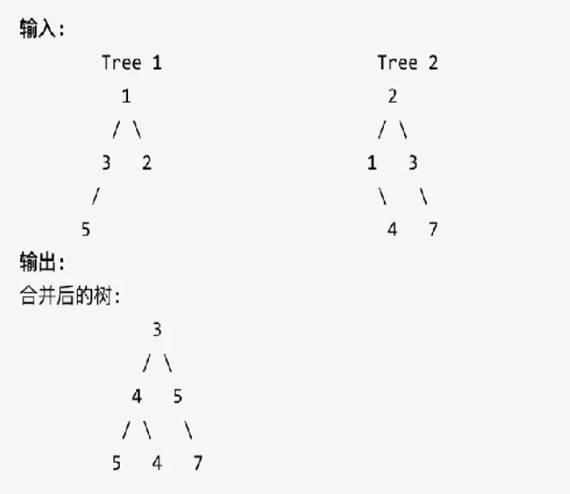

# 实验四

## 问题分析

### 问题与功能描述：

#### 【问题描述】

二叉树的合并

给定两个二叉树，将它们中的一个覆盖到另一个上时，两个二叉树的一些节点便会重叠，你需要根据规则将他们合并为一个新的二叉树。合并的规则是如果两个节点重叠，那么将它们的值相加作为节点合并后的新值，否则不为 NULL 的节点将直接作为新二叉树的节点。

示例 :



#### 【输入形式】

每个输入文件的第一行为二叉树A的前序遍历顺序表示法（N≤30）。

第二行为二叉树B的前序遍历顺序表示法（N≤30）。

注意：用“#”代表空指针NULL。

#### 【输出形式】

 输出为合并之后的二叉树的前序遍历顺序表示法。用“#”代表空指针NULL。

### 样例分析：

#### 求解方法

题目要求合并两个二叉树，如果对应节点有重叠，则将它们的值相加作为合并后的节点的新值；否则，不为NULL的节点将直接作为新二叉树的节点。

因此，我们可以按照以下步骤来实现合并：

1. 对于两个给定的二叉树，分别遍历它们，得到它们的前序遍历序列。
2. 从两个序列的第一个节点开始比较，如果它们都不为NULL，则将它们的值相加，并新建一个节点存储相加后的值。
3. 如果其中一个节点为NULL，则将另一个节点作为新建节点的左或右孩子节点。
4. 对新建节点的左右孩子节点递归执行上述合并操作，直到两个序列中的所有节点都被处理完毕。
5. 最后，得到的二叉树即为合并后的结果。

需要注意的是，在合并两个节点的值时，需要考虑两个节点都为NULL的情况，此时新建一个节点存储0值。此外，由于题目中规定了节点值不会超过9，因此可以将节点值转化为字符型处理，而不是直接存储为整型。

【样例输入1】

135###2##

21#4##3#7##

【样例输出1】

345##4##5#7##


【样例输入2】

 324##3##235###5##

 323####

【样例输出2】

 647##3##235###5##


【样例输入3】

 324##3##235###5##

 232###5##

【样例输出3】

 556##3##735###5##

### 数据结构分析：

#### 【抽象数据类型设计】

二叉树 BinNode:

- 数据成员：
  - value：节点的值
  - left：节点的左子树
  - right：节点的右子树
- 成员函数：
  - getValue()：获取节点的值
  - setValue()：设置节点的值
  - left()：获取节点的左子树
  - setLeft()：设置节点的左子树
  - right()：获取节点的右子树
  - setRight()：设置节点的右子树

#### 【物理数据对象设计】

采用二叉链表存储结构实现二叉树 BinNode。

具体实现可参考 tree.h 和 TTree.h 文件中的代码。

#### 【算法思想的设计】

二叉树的递归遍历。

#### 【关键功能的算法步骤】

1. 读入两个二叉树的前序遍历顺序表示法，创建二叉树 BinNode1 和 BinNode2。
2. 定义递归函数 mergeTrees，将二叉树 BinNode1 和 BinNode2 合并成一个新的二叉树。
3. 若其中一个节点为空，则直接返回另一个节点。
4. 新建一个节点 tmp，节点值为两个节点的值相加。
5. 将两个节点的左子树递归合并，将结果设置为 tmp 的左子树。
6. 将两个节点的右子树递归合并，将结果设置为 tmp 的右子树。
7. 返回 tmp。
8. 调用 mergeTrees 函数得到合并后的二叉树 BinNode3。
9. 对合并后的二叉树进行前序遍历输出。

注：节点值为字符，需要将其转换为数字类型。

#### 【物理实现】

```c++
BinNode<int> *creatBinaryTree() {
	char c;
	cin >> c;
	if (c == '#')
		return NULL;
	BinNode<int> *root = new BinNode<int>;
	root->setValue((int)c - 48);
	root->setLeft(creatBinaryTree());
	root->setRight(creatBinaryTree());
	return root;
}

BinNode<int> *mergeTrees(BinNode<int> *t1, BinNode<int> *t2) {
	if (t2 == NULL)
		return t1;
	if (t1 == NULL)
		return t2;
	BinNode<int> *tmp = new BinNode<int>;
	tmp->setValue(t1->getValue() + t2->getValue());
	tmp->setLeft(mergeTrees(t1->left(), t2->left()));
	tmp->setRight(mergeTrees(t1->right(), t2->right()));
	return tmp;
}

void printNode(BinNode<int> *root) {
	if (root) {
		cout << root->getValue();
		printNode(root->left());
		printNode(root->right());
	} else
		printf("#");
}
```

#### 【代码分析】

1. 定义一个函数`creatBinaryTree()`，用于根据前序遍历顺序表示法输入二叉树并构建相应的二叉树，返回二叉树的根节点。
2. 定义一个函数`mergeTrees(BinNode<int> *t1, BinNode<int> *t2)`，用于合并两棵二叉树`t1`和`t2`，返回合并后的二叉树的根节点。
3. 如果`t2`为NULL，则直接返回`t1`。
4. 如果`t1`为NULL，则直接返回`t2`。
5. 否则，定义一个新节点`tmp`，该节点的值为`t1`和`t2`节点值之和。
6. `tmp`的左子树为合并`t1`的左子树和`t2`的左子树，即`mergeTrees(t1->left(), t2->left())`。
7. `tmp`的右子树为合并`t1`的右子树和`t2`的右子树，即`mergeTrees(t1->right(), t2->right())`。
8. 返回`tmp`。
9. 定义一个函数`printNode(BinNode<int> *root)`，用于前序遍历输出二叉树。
10. 在`main()`函数中，调用`creatBinaryTree()`函数构建两棵二叉树`root1`和`root2`。
11. 调用`mergeTrees()`函数合并`root1`和`root2`，得到合并后的二叉树的根节点。
12. 调用`printNode()`函数前序遍历输出合并后的二叉树。

### 算法分析

#### 关键步骤

```c++
int main() {

	BinNode<int> *root1, * root2;
	root1 = new BinNode<int>;
	root2 = new BinNode<int>;
	root1 = creatBinaryTree();
	root2 = creatBinaryTree();
	BinNode<int> *ans = mergeTrees(root1, root2);
	printNode(ans);
	return 0;
}
```

#### 算法性能分析

该算法的时间复杂度取决于遍历二叉树的次数，即所有节点的数量，所以为O(n)，其中n为所有节点的数量。

空间复杂度也取决于节点数量，每个节点需要一个存储该节点值的变量，以及指向左右子树的指针，所以空间复杂度也为O(n)。

综上，该算法的时间复杂度和空间复杂度都为O(n)，其中n为所有节点的数量。

