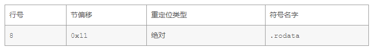
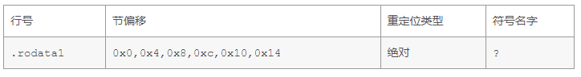

# 第七章

## 7.12

```txt
15	0x804945c	0x8049454
16	0x8049458	0x0000002
18	0x8049548	0x8049458
18	0x8049458	0x0000002
23	0x8049548	0x8049458
```

## 7.13

```C
extern int p3(void);
int x=1;
int *xp = &x;

void p2(int y) {
}

void p1() {
   p2(*xp + p3());
}
```

可重定位目标文件的`.text`节和`.data`节如下：

```txt
szh@ubuntu:~/cs/7$ objdump -d -j .text 13.o

13.o：     文件格式 elf64-x86-64
Disassembly of section .text:

0000000000000000 <p2>:
   0:	f3 0f 1e fa          	endbr64 
   4:	55                   	push   %rbp
   5:	48 89 e5             	mov    %rsp,%rbp
   8:	89 7d fc             	mov    %edi,-0x4(%rbp)
   b:	90                   	nop
   c:	5d                   	pop    %rbp
   d:	c3                   	retq   

000000000000000e <p1>:
   e:	f3 0f 1e fa          	endbr64 
  12:	55                   	push   %rbp
  13:	48 89 e5             	mov    %rsp,%rbp
  16:	53                   	push   %rbx
  17:	48 83 ec 08          	sub    $0x8,%rsp
  1b:	48 8b 05 00 00 00 00 	mov    0x0(%rip),%rax        # 22 <p1+0x14>
  22:	8b 18                	mov    (%rax),%ebx
  24:	e8 00 00 00 00       	callq  29 <p1+0x1b>
  29:	01 d8                	add    %ebx,%eax
  2b:	89 c7                	mov    %eax,%edi
  2d:	e8 00 00 00 00       	callq  32 <p1+0x24>
  32:	90                   	nop
  33:	48 83 c4 08          	add    $0x8,%rsp
  37:	5b                   	pop    %rbx
  38:	5d                   	pop    %rbp
  39:	c3                   	retq   
  
  
szh@ubuntu:~/cs/7$ objdump -s -j .data 13.o

13.o：     文件格式 elf64-x86-64
Contents of section .data:
 0000 01000000                             ....          
```

A. .text中需要重定位的指令：

```
0000000000000016 <p1>:
  16:	53                   	push   %rbx
  17:	48 83 ec 08          	sub    $0x8,%rsp
  1b:	48 8b 05 00 00 00 00 	mov    0x0(%rip),%rax        # 22 <p1+0xc>
  22:	8b 18                	mov    (%rax),%ebx
  24:	e8 00 00 00 00       	callq  29 <p1+0x13>
  29:	01 d8                	add    %ebx,%eax
  2b:	89 c7                	mov    %eax,%edi
  2d:	e8 00 00 00 00       	callq  32 <p1+0x1c>
```

其中，需要重定位的指令是：

```
1b:	48 8b 05 00 00 00 00 	mov    0x0(%rip),%rax        # 22 <p1+0xc>
```

对应的重定位条目信息如下：

```
Relocation section '.rela.text' at offset 0x218 contains 2 entries:
  Offset          Type           Sym. Value    Sym. Name + Addend
000000000000001b  R_X86_64_PC32    0000000000000000 x - 4
000000000000002d  R_X86_64_PLT32   0000000000000000 p3 - 4
```

可知，这个指令需要进行 PC 相对定位，并且修改的符号名字是 x。需要修改的位置是偏移量为 0x1b 处的指令中的“0x0(%rip)”部分，也就是 x 的位置。链接器会将此指令修改为：

```
48 8b 05 xx xx xx xx
```

其中，xx xx xx xx 是指向 x 符号的地址。

B. .data中需要重定位的数据：

```
Contents of section .data:
 0000 01000000                             ....     
```

需要重定位的数据为：

```
0000000000000000  01000000 00000000
```

对应的重定位条目信息如下：

```
Relocation section '.rela.data' at offset 0x240 contains 1 entry:
  Offset          Type           Sym. Value    Sym. Name + Addend
0000000000000000  R_X86_64_32      0000000000000000 x
```

可知，这个数据需要进行绝对定位，并且修改的符号名字是 x。需要修改的位置是偏移量为 0x0 处的数据。链接器会将此数据修改为：

```
01 00 00 00
```

其中，01 00 00 00 是 x 的值。

## 7.14

汇编代码其实比较好理解。eax 是 val ，最开始 val-100 和 5 比较，如果大于 5 ，就直接到 16 行去 +6 。
否则根据跳转表跳到相应的地址（edx*4+0）。
所以，重定位时，需要将所有的 ja 和 jmp 指令的目的地修改为对应的地址。
需要注意的是第 8 行，jmp *0x0(,%edx,4) 这一句。
这里的 0x0 是指 .rodata 的地址，这是肯定需要重定位的。

在.rodata中，所有的跳转表都需要重定位到相应代码的位置。



