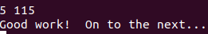

# CSAPP    Bomblab

## 一.实验基本内容与要求

本次实验为熟悉汇编程序及其调试方法的实验。
实验内容包含3个文件：`bomb`（可执行文件）和`bomb.c`（c源文件）以及一个`README`文件。
实验主题内容为：
程序运行在`linux`环境中。程序运行中有6个关卡（6个`phase`），每个phase需要用户在终端上输入特定的字符或者数字才能通关，否则会引爆炸弹！那么如何才能知道输入什么内容呢？这需要你使用`gdb`工具反汇编出汇编代码，结合c语言文件找到每个关卡的入口函数。然后分析汇编代码，找到在每个`phase`程序段中，引导程序跳转到`explode_bomb`程序段的地方，并分析其成功跳转的条件，以此为突破口寻找应该在命令行输入何种字符通关。

实验需要用到gdb工具，可到网上查找gdb使用方法和参数。

## 二.准备工作

首先我在32位的Ubuntu中尝试了很多次，总是显示二进制文件不可执行。上网查询知可能是因为64位下的二进制可执行文件不可以在32位的机器中运行。而且将其反汇编后，我发现反汇编文件的第二行为：`bomb：   文件格式 elf64-x86-64`，说明该实验需要在64位Ubuntu中进行。进入文件夹后使用`./bomb`执行该可执行文件报错，报错信息为：`./bomb: /lib/x86_64-linux-gnu/libc.so.6: version GLIBC_2.34' not found (required by ./bomb)`。上网查询知道`GLIBC`的最高版本只到2.30，由于使用的系统为ubuntu20.04，已经升级到了系统版本的最高版本了。所以需要编辑源：`sudo vi /etc/apt/sources.list`，然后添加高版本的源：`deb http://th.archive.ubuntu.com/ubuntu jammy main    #添加该行到文件`，再运行升级：`sudo apt update` `sudo apt install libc6`，等待执行成功后可以看到：

```txt
strings /lib/x86_64-linux-gnu/libc.so.6 |grep GLIBC_
GLIBC_2.2.5
GLIBC_2.2.6
GLIBC_2.3
GLIBC_2.3.2
GLIBC_2.3.3
GLIBC_2.3.4
GLIBC_2.4
GLIBC_2.5
GLIBC_2.6
GLIBC_2.7
GLIBC_2.8
GLIBC_2.9
GLIBC_2.10
GLIBC_2.11
GLIBC_2.12
GLIBC_2.13
GLIBC_2.14
GLIBC_2.15
GLIBC_2.16
GLIBC_2.17
GLIBC_2.18
GLIBC_2.22
GLIBC_2.23
GLIBC_2.24
GLIBC_2.25
GLIBC_2.26
GLIBC_2.27
GLIBC_2.28
GLIBC_2.29
GLIBC_2.30
GLIBC_2.31   //以下为新增
GLIBC_2.32
GLIBC_2.33
GLIBC_2.34
GLIBC_2.35
GLIBC_PRIVATE
```

再次进入`bomblab`文件夹，执行`./bomb`，出现`Welcome to my fiendish little bomb. You have 6 phases with 
which to blow yourself up. Have a nice day!`，环境配置成功！

将bomb文件通过`objdump -d bomb > bomb.txt`命令反汇编并生成.txt文件，这样可以在`bomb.txt`中结合gdb进行分析

随意输入sd，提示爆炸，表示输入错误。接下来就深入各个`phase`函数去看看怎么拆炸弹吧


## 三.拆解炸弹

### (1) phase_1

#### 1. 汇编代码

通过`disas`指令查看某函数的汇编代码

```assembly
phase_1:
Dump of assembler code for function phase_1:
   0x00000000000015e7 <+0>:	endbr64 
   0x00000000000015eb <+4>:	sub    $0x8,%rsp
   0x00000000000015ef <+8>:	lea    0x1b5a(%rip),%rsi        # 0x3150
   0x00000000000015f6 <+15>:	callq  0x1b25 <strings_not_equal>
   0x00000000000015fb <+20>:	test   %eax,%eax
   0x00000000000015fd <+22>:	jne    0x1604 <phase_1+29>
   0x00000000000015ff <+24>:	add    $0x8,%rsp
   0x0000000000001603 <+28>:	retq   
   0x0000000000001604 <+29>:	callq  0x1c39 <explode_bomb>
   0x0000000000001609 <+34>:	jmp    0x15ff <phase_1+24>
End of assembler dump.

strings_not_equal:
Dump of assembler code for function strings_not_equal:
   0x0000000000001b25 <+0>:	endbr64 
   0x0000000000001b29 <+4>:	push   %r12
   0x0000000000001b2b <+6>:	push   %rbp
   0x0000000000001b2c <+7>:	push   %rbx
   0x0000000000001b2d <+8>:	mov    %rdi,%rbx //输入字符串
   0x0000000000001b30 <+11>:	mov    %rsi,%rbp //答案字符串
   0x0000000000001b33 <+14>:	callq  0x1b04 <string_length> //得到输入字符串的长度
   0x0000000000001b38 <+19>:	mov    %eax,%r12d
   0x0000000000001b3b <+22>:	mov    %rbp,%rdi
   0x0000000000001b3e <+25>:	callq  0x1b04 <string_length> //得到答案字符串的长度
   0x0000000000001b43 <+30>:	mov    %eax,%edx
   0x0000000000001b45 <+32>:	mov    $0x1,%eax
   0x0000000000001b4a <+37>:	cmp    %edx,%r12d //比较两个长度
   0x0000000000001b4d <+40>:	jne    0x1b80 <strings_not_equal+91> //不相等则跳到结束返回值为0
   0x0000000000001b4f <+42>:	movzbl (%rbx),%edx
   0x0000000000001b52 <+45>:	test   %dl,%dl //检测输入字符串是否为空
   0x0000000000001b54 <+47>:	je     0x1b74 <strings_not_equal+79> //为空则跳到结束返回值为0
   0x0000000000001b56 <+49>:	mov    $0x0,%eax
   0x0000000000001b5b <+54>:	cmp    %dl,0x0(%rbp,%rax,1) //比较目标字符串与答案字符串字符是否相等
   0x0000000000001b5f <+58>:	jne    0x1b7b <strings_not_equal+86>
   0x0000000000001b61 <+60>:	add    $0x1,%rax
   0x0000000000001b65 <+64>:	movzbl (%rbx,%rax,1),%edx
   0x0000000000001b69 <+68>:	test   %dl,%dl
   0x0000000000001b6b <+70>:	jne    0x1b5b <strings_not_equal+54>
   0x0000000000001b6d <+72>:	mov    $0x0,%eax
   0x0000000000001b72 <+77>:	jmp    0x1b80 <strings_not_equal+91>
   0x0000000000001b74 <+79>:	mov    $0x0,%eax
   0x0000000000001b79 <+84>:	jmp    0x1b80 <strings_not_equal+91>
   0x0000000000001b7b <+86>:	mov    $0x1,%eax
   0x0000000000001b80 <+91>:	pop    %rbx
   0x0000000000001b81 <+92>:	pop    %rbp
   0x0000000000001b82 <+93>:	pop    %r12
   0x0000000000001b84 <+95>:	retq   
End of assembler dump.

string_length:
Dump of assembler code for function string_length:
   0x0000000000001b04 <+0>:	endbr64 
   0x0000000000001b08 <+4>:	cmpb   $0x0,(%rdi)
   0x0000000000001b0b <+7>:	je     0x1b1f <string_length+27>
   0x0000000000001b0d <+9>:	mov    $0x0,%eax
   0x0000000000001b12 <+14>:	add    $0x1,%rdi
   0x0000000000001b16 <+18>:	add    $0x1,%eax
   0x0000000000001b19 <+21>:	cmpb   $0x0,(%rdi)
   0x0000000000001b1c <+24>:	jne    0x1b12 <string_length+14>
   0x0000000000001b1e <+26>:	retq   
   0x0000000000001b1f <+27>:	mov    $0x0,%eax
   0x0000000000001b24 <+32>:	retq   
End of assembler dump.
```

#### 2. 汇编分析

可以看到，调用了 `strings_not_equal` 函数，它首先得到我们输入字符串长度，然后得到正确答案字符串长度，进行比较，看二者长度是否相等；若二者长度相等，则逐个比较二者字符串内容。

在进入`phase_1`之前输入了一段字符串，在`phase_1`中将输入的字符串与以`0x3150`为首地址的字符串作比较，若相等则通关，否则炸弹爆炸；

以`0x3150`为首地址的字符串：


因此，第一关要输入的就是:`I turned the moon into something I call a Death Star.`

#### 3. 测试


通过第一关！

### (2) phase_2

#### 1. 汇编代码

```assembly
Dump of assembler code for function phase_2:
   0x000000000000160b <+0>:	endbr64 
   0x000000000000160f <+4>:	push   %rbp
   0x0000000000001610 <+5>:	push   %rbx
   0x0000000000001611 <+6>:	sub    $0x28,%rsp
   0x0000000000001615 <+10>:	mov    %fs:0x28,%rax
   0x000000000000161e <+19>:	mov    %rax,0x18(%rsp)
   0x0000000000001623 <+24>:	xor    %eax,%eax
   0x0000000000001625 <+26>:	mov    %rsp,%rsi
   0x0000000000001628 <+29>:	callq  0x1c65 <read_six_numbers>
   0x000000000000162d <+34>:	cmpl   $0x1,(%rsp)
   0x0000000000001631 <+38>:	jne    0x163d <phase_2+50>
   0x0000000000001633 <+40>:	mov    %rsp,%rbx
   0x0000000000001636 <+43>:	lea    0x14(%rsp),%rbp
   0x000000000000163b <+48>:	jmp    0x164d <phase_2+66>
   0x000000000000163d <+50>:	callq  0x1c39 <explode_bomb>
   0x0000000000001642 <+55>:	jmp    0x1633 <phase_2+40>
   0x0000000000001644 <+57>:	add    $0x4,%rbx
   0x0000000000001648 <+61>:	cmp    %rbp,%rbx
   0x000000000000164b <+64>:	je     0x165d <phase_2+82>
   0x000000000000164d <+66>:	mov    (%rbx),%eax
   0x000000000000164f <+68>:	add    %eax,%eax
   0x0000000000001651 <+70>:	cmp    %eax,0x4(%rbx)
   0x0000000000001654 <+73>:	je     0x1644 <phase_2+57>
   0x0000000000001656 <+75>:	callq  0x1c39 <explode_bomb>
   0x000000000000165b <+80>:	jmp    0x1644 <phase_2+57>
   0x000000000000165d <+82>:	mov    0x18(%rsp),%rax
   0x0000000000001662 <+87>:	sub    %fs:0x28,%rax
   0x000000000000166b <+96>:	jne    0x1674 <phase_2+105>
   0x000000000000166d <+98>:	add    $0x28,%rsp
   0x0000000000001671 <+102>:	pop    %rbx
   0x0000000000001672 <+103>:	pop    %rbp
   0x0000000000001673 <+104>:	retq   
   0x0000000000001674 <+105>:	callq  0x1250 <__stack_chk_fail@plt>
End of assembler dump.
```

#### 2. 汇编分析

进入`read_six_numbers`：

```assembly
Dump of assembler code for function read_six_numbers:
   0x0000000000001c65 <+0>:	endbr64 
   0x0000000000001c69 <+4>:	sub    $0x8,%rsp
   0x0000000000001c6d <+8>:	mov    %rsi,%rdx
   0x0000000000001c70 <+11>:	lea    0x4(%rsi),%rcx
   0x0000000000001c74 <+15>:	lea    0x14(%rsi),%rax
   0x0000000000001c78 <+19>:	push   %rax
   0x0000000000001c79 <+20>:	lea    0x10(%rsi),%rax
   0x0000000000001c7d <+24>:	push   %rax
   0x0000000000001c7e <+25>:	lea    0xc(%rsi),%r9
   0x0000000000001c82 <+29>:	lea    0x8(%rsi),%r8
   0x0000000000001c86 <+33>:	lea    0x1696(%rip),%rsi        # 0x3323
   0x0000000000001c8d <+40>:	mov    $0x0,%eax
   0x0000000000001c92 <+45>:	callq  0x1300 <__isoc99_sscanf@plt>
   0x0000000000001c97 <+50>:	add    $0x10,%rsp
   0x0000000000001c9b <+54>:	cmp    $0x5,%eax
   0x0000000000001c9e <+57>:	jle    0x1ca5 <read_six_numbers+64>
   0x0000000000001ca0 <+59>:	add    $0x8,%rsp
   0x0000000000001ca4 <+63>:	retq   
   0x0000000000001ca5 <+64>:	callq  0x1c39 <explode_bomb>
End of assembler dump.
```

结合函数名以及与5相比较，可以推测这个函数的作用是判断输入数字个数是否为6，即输入应该是6个数字

再继续分析调用完`read_six_numbers`后的汇编代码

```assembly
0x000000000000162d <+34>:	cmpl   $0x1,(%rsp)
0x0000000000001631 <+38>:	jne    0x163d <phase_2+50>
0x0000000000001633 <+40>:	mov    %rsp,%rbx
0x0000000000001636 <+43>:	lea    0x14(%rsp),%rbp
0x000000000000163b <+48>:	jmp    0x164d <phase_2+66>
0x000000000000163d <+50>:	callq  0x1c39 <explode_bomb>
0x0000000000001642 <+55>:	jmp    0x1633 <phase_2+40>

0x0000000000001644 <+57>:	add    $0x4,%rbx //循环
0x0000000000001648 <+61>:	cmp    %rbp,%rbx
0x000000000000164b <+64>:	je     0x165d <phase_2+82>
0x000000000000164d <+66>:	mov    (%rbx),%eax
0x000000000000164f <+68>:	add    %eax,%eax //翻倍
0x0000000000001651 <+70>:	cmp    %eax,0x4(%rbx)
0x0000000000001654 <+73>:	je     0x1644 <phase_2+57>
0x0000000000001656 <+75>:	callq  0x1c39 <explode_bomb>
```

比较1和M(%rsp)，不相等则跳转到`0x163d`（爆炸），相等才继续执行，说明输入的第一个数字是1。这里的%eax保存的是Xi-1，%ebx保存的是Xi的地址，将%eax加倍后与（%ebx）相比较，不相等则爆炸；因此六个数的关系就确定了，`Xi=2*Xi+1` （X0=1）；这个循环执行了五次，每次把前面的数翻了一倍，如果后一个数不等于前一个数的两倍则爆炸。

故第二关的密码是：`1 2 4 8 16 32`

#### 3. 测试


通过第二关！

### (3) phase_3

#### 1. 汇编代码

```assembly
Dump of assembler code for function phase_3:
   0x0000000000001679 <+0>:	endbr64 
   0x000000000000167d <+4>:	sub    $0x18,%rsp
   0x0000000000001681 <+8>:	mov    %fs:0x28,%rax
   0x000000000000168a <+17>:	mov    %rax,0x8(%rsp)
   0x000000000000168f <+22>:	xor    %eax,%eax
   0x0000000000001691 <+24>:	lea    0x4(%rsp),%rcx
   0x0000000000001696 <+29>:	mov    %rsp,%rdx
   0x0000000000001699 <+32>:	lea    0x1c8f(%rip),%rsi        # 0x332f
   0x00000000000016a0 <+39>:	callq  0x1300 <__isoc99_sscanf@plt>
   0x00000000000016a5 <+44>:	cmp    $0x1,%eax
   0x00000000000016a8 <+47>:	jle    0x16c8 <phase_3+79>
   0x00000000000016aa <+49>:	cmpl   $0x7,(%rsp)
   0x00000000000016ae <+53>:	ja     0x174e <phase_3+213>
   0x00000000000016b4 <+59>:	mov    (%rsp),%eax
   0x00000000000016b7 <+62>:	lea    0x1b02(%rip),%rdx        # 0x31c0
   0x00000000000016be <+69>:	movslq (%rdx,%rax,4),%rax
   0x00000000000016c2 <+73>:	add    %rdx,%rax
   0x00000000000016c5 <+76>:	notrack jmpq *%rax //跳转
   0x00000000000016c8 <+79>:	callq  0x1c39 <explode_bomb>
   0x00000000000016cd <+84>:	jmp    0x16aa <phase_3+49>
   0x00000000000016cf <+86>:	mov    $0x1e3,%eax
   0x00000000000016d4 <+91>:	sub    $0xdf,%eax
   0x00000000000016d9 <+96>:	add    $0x334,%eax
   0x00000000000016de <+101>:	sub    $0x21d,%eax
   0x00000000000016e3 <+106>:	add    $0x21d,%eax
   0x00000000000016e8 <+111>:	sub    $0x21d,%eax
   0x00000000000016ed <+116>:	add    $0x21d,%eax
   0x00000000000016f2 <+121>:	sub    $0x21d,%eax
   0x00000000000016f7 <+126>:	cmpl   $0x5,(%rsp)
   0x00000000000016fb <+130>:	jg     0x1703 <phase_3+138>
   0x00000000000016fd <+132>:	cmp    %eax,0x4(%rsp)
   0x0000000000001701 <+136>:	je     0x1708 <phase_3+143>
   0x0000000000001703 <+138>:	callq  0x1c39 <explode_bomb>
   0x0000000000001708 <+143>:	mov    0x8(%rsp),%rax
   0x000000000000170d <+148>:	sub    %fs:0x28,%rax
   0x0000000000001716 <+157>:	jne    0x175a <phase_3+225>
   0x0000000000001718 <+159>:	add    $0x18,%rsp
   0x000000000000171c <+163>:	retq   
   0x000000000000171d <+164>:	mov    $0x0,%eax
   0x0000000000001722 <+169>:	jmp    0x16d4 <phase_3+91>
   0x0000000000001724 <+171>:	mov    $0x0,%eax
   0x0000000000001729 <+176>:	jmp    0x16d9 <phase_3+96>
   0x000000000000172b <+178>:	mov    $0x0,%eax
   0x0000000000001730 <+183>:	jmp    0x16de <phase_3+101>
   0x0000000000001732 <+185>:	mov    $0x0,%eax
   0x0000000000001737 <+190>:	jmp    0x16e3 <phase_3+106>
   0x0000000000001739 <+192>:	mov    $0x0,%eax
   0x000000000000173e <+197>:	jmp    0x16e8 <phase_3+111>
   0x0000000000001740 <+199>:	mov    $0x0,%eax
   0x0000000000001745 <+204>:	jmp    0x16ed <phase_3+116>
   0x0000000000001747 <+206>:	mov    $0x0,%eax
   0x000000000000174c <+211>:	jmp    0x16f2 <phase_3+121>
   0x000000000000174e <+213>:	callq  0x1c39 <explode_bomb>
   0x0000000000001753 <+218>:	mov    $0x0,%eax
   0x0000000000001758 <+223>:	jmp    0x16f7 <phase_3+126>
   0x000000000000175a <+225>:	callq  0x1250 <__stack_chk_fail@plt>
End of assembler dump.
```

#### 2. 汇编分析

```assembly
0x0000000000001699 <+32>:	lea    0x1c8f(%rip),%rsi        # 0x332f
0x00000000000016a0 <+39>:	callq  0x1300 <__isoc99_sscanf@plt>
```

这是将`0x332f`作为`call < isoc99_sscanf@plt >`的参数，而`0x332f`的内容是：


可以确定输入为：整数+整数

输入后的前两个语句就是比较1和第一个输入的关系，小于等于1则爆炸；

```assembly
0x00000000000016a5 <+44>:	cmp    $0x1,%eax
0x00000000000016a8 <+47>:	jle    0x16c8 <phase_3+79>
```

接着比较7和第一个输入的关系，大于7则爆炸。

```assembly
0x00000000000016aa <+49>:	cmpl   $0x7,(%rsp)
0x00000000000016ae <+53>:	ja     0x174e <phase_3+213>
```

这两个语句限制了`0<X0<8`

1. 需要执行的算数操作：

   ```assembly
   0x00000000000016cf <+86>:	mov    $0x1e3,%eax
   0x00000000000016d4 <+91>:	sub    $0xdf,%eax
   0x00000000000016d9 <+96>:	add    $0x334,%eax
   0x00000000000016de <+101>:	sub    $0x21d,%eax
   0x00000000000016e3 <+106>:	add    $0x21d,%eax
   0x00000000000016e8 <+111>:	sub    $0x21d,%eax
   0x00000000000016ed <+116>:	add    $0x21d,%eax
   0x00000000000016f2 <+121>:	sub    $0x21d,%eax
   ```

2. 跳转表如下，且无论如何eax总是被初始化为0

   ```assembly
   0x000000000000171d <+164>:	mov    $0x0,%eax
   0x0000000000001722 <+169>:	jmp    0x16d4 <phase_3+91>
   0x0000000000001724 <+171>:	mov    $0x0,%eax
   0x0000000000001729 <+176>:	jmp    0x16d9 <phase_3+96>
   0x000000000000172b <+178>:	mov    $0x0,%eax
   0x0000000000001730 <+183>:	jmp    0x16de <phase_3+101>
   0x0000000000001732 <+185>:	mov    $0x0,%eax
   0x0000000000001737 <+190>:	jmp    0x16e3 <phase_3+106>
   0x0000000000001739 <+192>:	mov    $0x0,%eax
   0x000000000000173e <+197>:	jmp    0x16e8 <phase_3+111>
   0x0000000000001740 <+199>:	mov    $0x0,%eax
   0x0000000000001745 <+204>:	jmp    0x16ed <phase_3+116>
   0x0000000000001747 <+206>:	mov    $0x0,%eax
   0x000000000000174c <+211>:	jmp    0x16f2 <phase_3+121>
   0x000000000000174e <+213>:	callq  0x1c39 <explode_bomb>
   ```

3. 以下指令又限制了x0的大小必须是小于5的，否则爆炸

   ```assembly
   0x00000000000016f7 <+126>:	cmpl   $0x5,(%rsp)
   0x00000000000016fb <+130>:	jg     0x1703 <phase_3+138>
   ```

4. 我们可以选择5，这样操作起来需要进行加减法的次数最少。此时x1的值=-0x21d+0x21d-0x21d=-0x21d=-541

5. 可以根据汇编代码写出大致的C语言程序：

```c
__int64 __fastcall phase_3(__int64 a1)
{
  __int64 v1; // rdx
  int v2; // eax
  int v3; // eax
  int v4; // eax
  int v5; // eax
  int v6; // eax
  int v7; // eax
  int v8; // eax
  int v9; // eax
  __int64 result; // rax
  int v11; // [rsp+0h] [rbp-18h] BYREF
  int v12; // [rsp+4h] [rbp-14h] BYREF
  unsigned __int64 v13; // [rsp+8h] [rbp-10h]

  v13 = __readfsqword(0x28u);
  if ( __isoc99_sscanf(a1, "%d %d", &v11, &v12) <= 1 )
    explode_bomb(a1);
  switch ( v11 )
  {
    case 0:
      v2 = 483;
      goto LABEL_5;
    case 1:
      v2 = 0;
LABEL_5:
      v3 = v2 - 223;
      goto LABEL_6;
    case 2:
      v3 = 0;
LABEL_6:
      v4 = v3 + 820;
      goto LABEL_7;
    case 3:
      v4 = 0;
LABEL_7:
      v5 = v4 - 541;
      goto LABEL_8;
    case 4:
      v5 = 0;
LABEL_8:
      v6 = v5 + 541;
      goto LABEL_9;
    case 5:
      v6 = 0;
LABEL_9:
      v7 = v6 - 541;
      goto LABEL_10;
    case 6:
      v7 = 0;
LABEL_10:
      v8 = v7 + 541;
      break;
    case 7:
      v8 = 0;
      break;
    default:
      explode_bomb(a1);
  }
  v9 = v8 - 541;
  if ( v11 > 5 || v12 != v9 )
    explode_bomb(a1);
  result = v13 - __readfsqword(0x28u);
  if ( result )
    return func4(a1, "%d %d", v1);
  return result;
}
```

#### 3. 测试

因此，我们测试`5 -541`：


通过第三关！

### (4) phase_4

#### 1.汇编代码

`phase_4`的汇编代码

```assembly
Dump of assembler code for function phase_4:
=> 0x00005555555557a0 <+0>:	endbr64 
   0x00005555555557a4 <+4>:	sub    $0x18,%rsp
   0x00005555555557a8 <+8>:	mov    %fs:0x28,%rax
   0x00005555555557b1 <+17>:	mov    %rax,0x8(%rsp)
   0x00005555555557b6 <+22>:	xor    %eax,%eax
   0x00005555555557b8 <+24>:	lea    0x4(%rsp),%rcx
   0x00005555555557bd <+29>:	mov    %rsp,%rdx
   0x00005555555557c0 <+32>:	lea    0x1b68(%rip),%rsi        # 0x55555555732f
   0x00005555555557c7 <+39>:	callq  0x555555555300 <__isoc99_sscanf@plt>
   0x00005555555557cc <+44>:	cmp    $0x2,%eax
   0x00005555555557cf <+47>:	jne    0x5555555557d7 <phase_4+55>
   0x00005555555557d1 <+49>:	cmpl   $0xe,(%rsp)
   0x00005555555557d5 <+53>:	jbe    0x5555555557dc <phase_4+60>
   0x00005555555557d7 <+55>:	callq  0x555555555c39 <explode_bomb>
   0x00005555555557dc <+60>:	mov    $0xe,%edx
   0x00005555555557e1 <+65>:	mov    $0x0,%esi
   0x00005555555557e6 <+70>:	mov    (%rsp),%edi
   0x00005555555557e9 <+73>:	callq  0x55555555575f <func4>
   0x00005555555557ee <+78>:	cmp    $0x1,%eax
   0x00005555555557f1 <+81>:	jne    0x5555555557fa <phase_4+90>
   0x00005555555557f3 <+83>:	cmpl   $0x1,0x4(%rsp)
   0x00005555555557f8 <+88>:	je     0x5555555557ff <phase_4+95>
   0x00005555555557fa <+90>:	callq  0x555555555c39 <explode_bomb>
   0x00005555555557ff <+95>:	mov    0x8(%rsp),%rax
   0x0000555555555804 <+100>:	sub    %fs:0x28,%rax
   0x000055555555580d <+109>:	jne    0x555555555814 <phase_4+116>
   0x000055555555580f <+111>:	add    $0x18,%rsp
   0x0000555555555813 <+115>:	retq   
   0x0000555555555814 <+116>:	callq  0x555555555250 <__stack_chk_fail@plt>
End of assembler dump.
```

`func4`的汇编代码

```assembly
Dump of assembler code for function func4:
   0x000000000000175f <+0>:	endbr64 
   0x0000000000001763 <+4>:	sub    $0x8,%rsp
   0x0000000000001767 <+8>:	mov    %edx,%eax
   0x0000000000001769 <+10>:	sub    %esi,%eax //a3-a2
   0x000000000000176b <+12>:	mov    %eax,%ecx 
   0x000000000000176d <+14>:	shr    $0x1f,%ecx //ecx为最高位 修正除法
   0x0000000000001770 <+17>:	add    %eax,%ecx 
   0x0000000000001772 <+19>:	sar    %ecx //除2
   0x0000000000001774 <+21>:	add    %esi,%ecx //v3 = a2 + ((int)a3 - (int)a2) / 2
   0x0000000000001776 <+23>:	cmp    %edi,%ecx //a1和v3比大小
   0x0000000000001778 <+25>:	jg     0x1786 <func4+39>
   0x000000000000177a <+27>:	mov    $0x0,%eax
   0x000000000000177f <+32>:	jl     0x1792 <func4+51>
   0x0000000000001781 <+34>:	add    $0x8,%rsp
   0x0000000000001785 <+38>:	retq   
   0x0000000000001786 <+39>:	lea    -0x1(%rcx),%edx //edx=v3-1
   0x0000000000001789 <+42>:	callq  0x175f <func4> //递归调用func
   0x000000000000178e <+47>:	add    %eax,%eax
   0x0000000000001790 <+49>:	jmp    0x1781 <func4+34>
   0x0000000000001792 <+51>:	lea    0x1(%rcx),%esi
   0x0000000000001795 <+54>:	callq  0x175f <func4>
   0x000000000000179a <+59>:	lea    0x1(%rax,%rax,1),%eax
   0x000000000000179e <+63>:	jmp    0x1781 <func4+34>
End of assembler dump.
```

#### 2.汇编分析

由以下语句可知，输入的第二个值必须为1，否则炸弹被引爆

```assembly
0x00005555555557f3 <+83>:	cmpl   $0x1,0x4(%rsp)
0x00005555555557f8 <+88>:	je     0x5555555557ff <phase_4+95>
0x00005555555557fa <+90>:	callq  0x555555555c39 <explode_bomb>
```

由以下语句可知，输入的第一个值X0必须满足`0<=X0<=14`，否则炸弹被引爆

```assembly
0x00005555555557d1 <+49>:	cmpl   $0xe,(%rsp)
0x00005555555557d5 <+53>:	jbe    0x5555555557dc <phase_4+60>
0x00005555555557d7 <+55>:	callq  0x555555555c39 <explode_bomb>
```

由以下语句可知，`func4`的返回值必须为1，否则炸弹被引爆

```assembly
0x00005555555557ee <+78>:	cmp    $0x1,%eax
0x00005555555557f1 <+81>:	jne    0x5555555557fa <phase_4+90>
```

可以根据汇编代码大致写出`func4`的C语言程序：

```C
int func4(int a1, int a2, int a3)
{
  int v3; // ecx
  v3 = a2 + ((int)a3 - (int)a2) / 2;
  if ( v3 > (int)a1 )
    return 2 * (unsigned int)func4(a1, a2, (unsigned int)(v3 - 1));
  if ( v3 < (int)a1 )
    return 2 * (unsigned int)func4(a1, (unsigned int)(v3 + 1), a3) + 1;
  return 0;
}
```

由上可知，`func4`函数是一个递归函数.因此我编写了一个C++程序来求出使`func4`返回值为-1的a1的值。

```C++
#include <bits/stdc++.h>
using namespace std;
int func4(int a1, int a2, int a3)
{
  int v3; // ecx
  v3 = a2 + ((int)a3 - (int)a2) / 2;
  if ( v3 > (int)a1 )
    return 2 * (unsigned int)func4(a1, a2, (unsigned int)(v3 - 1));
  if ( v3 < (int)a1 )
    return 2 * (unsigned int)func4(a1, (unsigned int)(v3 + 1), a3) + 1;
  return 0;
}

int main()
{
	for(int i=0;i<14;i++)
	{
		if(func4(i,0,14)==1) cout<<i<<" ";
	}
}

输出结果为：
8 9 11
```

因此可以判断出答案为`8/9/11 1`

#### 3.测试

选择`8 1`进入程序进行测试


通过第四关！

### (5) phase_5

#### 1.汇编代码

```assembly
Dump of assembler code for function phase_5:
   0x0000000000001819 <+0>:	endbr64 
   0x000000000000181d <+4>:	sub    $0x18,%rsp
   0x0000000000001821 <+8>:	mov    %fs:0x28,%rax
   0x000000000000182a <+17>:	mov    %rax,0x8(%rsp)
   0x000000000000182f <+22>:	xor    %eax,%eax
   0x0000000000001831 <+24>:	lea    0x4(%rsp),%rcx
   0x0000000000001836 <+29>:	mov    %rsp,%rdx
   0x0000000000001839 <+32>:	lea    0x1aef(%rip),%rsi        # 0x332f
   0x0000000000001840 <+39>:	callq  0x1300 <__isoc99_sscanf@plt>
   0x0000000000001845 <+44>:	cmp    $0x1,%eax
   0x0000000000001848 <+47>:	jle    0x18a4 <phase_5+139>
   0x000000000000184a <+49>:	mov    (%rsp),%eax
   0x000000000000184d <+52>:	and    $0xf,%eax
   0x0000000000001850 <+55>:	mov    %eax,(%rsp)
   0x0000000000001853 <+58>:	cmp    $0xf,%eax
   0x0000000000001856 <+61>:	je     0x188a <phase_5+113>
   0x0000000000001858 <+63>:	mov    $0x0,%ecx
   0x000000000000185d <+68>:	mov    $0x0,%edx
   0x0000000000001862 <+73>:	lea    0x1977(%rip),%rsi        # 0x31e0 <array.0>
   0x0000000000001869 <+80>:	add    $0x1,%edx
   0x000000000000186c <+83>:	cltq   
   0x000000000000186e <+85>:	mov    (%rsi,%rax,4),%eax
   0x0000000000001871 <+88>:	add    %eax,%ecx
   0x0000000000001873 <+90>:	cmp    $0xf,%eax
   0x0000000000001876 <+93>:	jne    0x1869 <phase_5+80>
   0x0000000000001878 <+95>:	movl   $0xf,(%rsp)
   0x000000000000187f <+102>:	cmp    $0xf,%edx
   0x0000000000001882 <+105>:	jne    0x188a <phase_5+113>
   0x0000000000001884 <+107>:	cmp    %ecx,0x4(%rsp)
   0x0000000000001888 <+111>:	je     0x188f <phase_5+118>
   0x000000000000188a <+113>:	callq  0x1c39 <explode_bomb>
   0x000000000000188f <+118>:	mov    0x8(%rsp),%rax
   0x0000000000001894 <+123>:	sub    %fs:0x28,%rax
   0x000000000000189d <+132>:	jne    0x18ab <phase_5+146>
   0x000000000000189f <+134>:	add    $0x18,%rsp
   0x00000000000018a3 <+138>:	retq   
   0x00000000000018a4 <+139>:	callq  0x1c39 <explode_bomb>
   0x00000000000018a9 <+144>:	jmp    0x184a <phase_5+49>
   0x00000000000018ab <+146>:	callq  0x1250 <__stack_chk_fail@plt>
End of assembler dump.
```

#### 2.汇编分析

根据汇编语言写出大致的C语言代码：

```c
__int64 __fastcall phase_5(__int64 a1)
{
  int v1; // eax
  int v2; // ecx
  int v3; // edx
  __int64 result; // rax
  int v5; // [rsp+0h] [rbp-18h] BYREF
  int v6; // [rsp+4h] [rbp-14h] BYREF
  unsigned __int64 v7; // [rsp+8h] [rbp-10h]

  v7 = __readfsqword(0x28u);
  if ( __isoc99_sscanf(a1, "%d %d", &v5, &v6) <= 1 )
    explode_bomb(a1);
  v1 = v5 & 0xF;
  v5 = v1;
  if ( v1 == 15 )
    goto LABEL_7;
  v2 = 0;
  v3 = 0;
  do
  {
    ++v3;
    v1 = array_0[v1];
    v2 += v1;
  }
  while ( v1 != 15 );
  v5 = 15;
  if ( v3 != 15 || v6 != v2 )
LABEL_7:
    explode_bomb(a1);
  result = v7 - __readfsqword(0x28u);
  if ( result )
    return phase_6(a1);
  return result;
}
```

`0x0000000000001839 <+32>:	lea    0x1aef(%rip),%rsi        # 0x332f`指令将立即数 `0x1aef` 加上 RIP 寄存器指向的下一条指令的地址，即计算出要访问的字符串的地址，然后将其存储到寄存器 RSI 中。在该程序中，该地址指向一个字符串常量。通过`(gdb) x/s 0x332f`查询到改地址中存放的是`0x332f:	"%d %d"`，代表输入两个整数。

由汇编指令`0x0000000000001862 <+73>:	lea    0x1977(%rip),%rsi        # 0x31e0 <array.0>`知`arr[0]`的地址为`0x31e0`，查看从内存地址`0x31e0`开始的 128 个字节的内容：

```assembly
(gdb) x/128bx 0x31e0
0x31e0 <array.0>:	0x0a	0x00	0x00	0x00	0x02	0x00	0x00	0x00
0x31e8 <array.0+8>:	0x0e	0x00	0x00	0x00	0x07	0x00	0x00	0x00
0x31f0 <array.0+16>:	0x08	0x00	0x00	0x00	0x0c	0x00	0x00	0x00
0x31f8 <array.0+24>:	0x0f	0x00	0x00	0x00	0x0b	0x00	0x00	0x00
0x3200 <array.0+32>:	0x00	0x00	0x00	0x00	0x04	0x00	0x00	0x00
0x3208 <array.0+40>:	0x01	0x00	0x00	0x00	0x0d	0x00	0x00	0x00
0x3210 <array.0+48>:	0x03	0x00	0x00	0x00	0x09	0x00	0x00	0x00
0x3218 <array.0+56>:	0x06	0x00	0x00	0x00	0x05	0x00	0x00	0x00
0x3220:	0x53	0x6f	0x20	0x79	0x6f	0x75	0x20	0x74
0x3228:	0x68	0x69	0x6e	0x6b	0x20	0x79	0x6f	0x75
0x3230:	0x20	0x63	0x61	0x6e	0x20	0x73	0x74	0x6f
0x3238:	0x70	0x20	0x74	0x68	0x65	0x20	0x62	0x6f
0x3240:	0x6d	0x62	0x20	0x77	0x69	0x74	0x68	0x20
0x3248:	0x63	0x74	0x72	0x6c	0x2d	0x63	0x2c	0x20
0x3250:	0x64	0x6f	0x20	0x79	0x6f	0x75	0x3f	0x00
0x3258:	0x43	0x75	0x72	0x73	0x65	0x73	0x2c	0x20
```

   这几条指令说明，eax会一直更新为`arr[eax]`，直到eax的值为0xf

```assembly
0x0000000000001869 <+80>:	add    $0x1,%edx
0x000000000000186c <+83>:	cltq   
0x000000000000186e <+85>:	mov    (%rsi,%rax,4),%eax
0x0000000000001871 <+88>:	add    %eax,%ecx
0x0000000000001873 <+90>:	cmp    $0xf,%eax
0x0000000000001876 <+93>:	jne    0x1869 <phase_5+80>
```

由这两条汇编指令知，循环会执行15次，否则发生爆炸

```assembly
0x000000000000187f <+102>:	cmp    $0xf,%edx
0x0000000000001882 <+105>:	jne    0x188a <phase_5+113>
```

所以逆序推15次，可以得到第一个输入的值 首先`arr[6]==0xf`

```txt
次数   eax
15     6
14     14
13     2
12     1
11     10
10     0
9      8
8      4
7      9
6      13
5      11
4      7
3      3 
2      12
1      5
```

所以输入的第一个值为5，输入的第二个值即为所有的eax累加，为115

所以应该输入的两个数字为`5 115`

#### 3.测试



通过第五关！

### (6) phase_6

#### 1.汇编代码

```assembly
Dump of assembler code for function phase_6:
   0x00000000000018b0 <+0>:	endbr64 
   0x00000000000018b4 <+4>:	push   %r14
   0x00000000000018b6 <+6>:	push   %r13
   0x00000000000018b8 <+8>:	push   %r12
   0x00000000000018ba <+10>:	push   %rbp
   0x00000000000018bb <+11>:	push   %rbx
   0x00000000000018bc <+12>:	sub    $0x60,%rsp
   0x00000000000018c0 <+16>:	mov    %fs:0x28,%rax
   0x00000000000018c9 <+25>:	mov    %rax,0x58(%rsp)
   0x00000000000018ce <+30>:	xor    %eax,%eax
   0x00000000000018d0 <+32>:	mov    %rsp,%r13
   0x00000000000018d3 <+35>:	mov    %r13,%rsi
   0x00000000000018d6 <+38>:	callq  0x1c65 <read_six_numbers>
   0x00000000000018db <+43>:	mov    $0x1,%r14d
   0x00000000000018e1 <+49>:	mov    %rsp,%r12
   0x00000000000018e4 <+52>:	jmp    0x190e <phase_6+94>
   0x00000000000018e6 <+54>:	callq  0x1c39 <explode_bomb>
   0x00000000000018eb <+59>:	jmp    0x191d <phase_6+109>
   0x00000000000018ed <+61>:	add    $0x1,%rbx
   0x00000000000018f1 <+65>:	cmp    $0x5,%ebx
   0x00000000000018f4 <+68>:	jg     0x1906 <phase_6+86>
   0x00000000000018f6 <+70>:	mov    (%r12,%rbx,4),%eax
   0x00000000000018fa <+74>:	cmp    %eax,0x0(%rbp)
   0x00000000000018fd <+77>:	jne    0x18ed <phase_6+61>
   0x00000000000018ff <+79>:	callq  0x1c39 <explode_bomb>
   0x0000000000001904 <+84>:	jmp    0x18ed <phase_6+61>
   0x0000000000001906 <+86>:	add    $0x1,%r14
   0x000000000000190a <+90>:	add    $0x4,%r13
   0x000000000000190e <+94>:	mov    %r13,%rbp
   0x0000000000001911 <+97>:	mov    0x0(%r13),%eax
   0x0000000000001915 <+101>:	sub    $0x1,%eax
   0x0000000000001918 <+104>:	cmp    $0x5,%eax
   0x000000000000191b <+107>:	ja     0x18e6 <phase_6+54>
   0x000000000000191d <+109>:	cmp    $0x5,%r14d
   0x0000000000001921 <+113>:	jg     0x1928 <phase_6+120>
   0x0000000000001923 <+115>:	mov    %r14,%rbx
   0x0000000000001926 <+118>:	jmp    0x18f6 <phase_6+70>
   0x0000000000001928 <+120>:	mov    $0x0,%esi
   0x000000000000192d <+125>:	mov    (%rsp,%rsi,4),%ecx
   0x0000000000001930 <+128>:	mov    $0x1,%eax
   0x0000000000001935 <+133>:	lea    0x38d4(%rip),%rdx        # 0x5210 <node1>
   0x000000000000193c <+140>:	cmp    $0x1,%ecx
   0x000000000000193f <+143>:	jle    0x194c <phase_6+156>
   0x0000000000001941 <+145>:	mov    0x8(%rdx),%rdx
   0x0000000000001945 <+149>:	add    $0x1,%eax
   0x0000000000001948 <+152>:	cmp    %ecx,%eax
   0x000000000000194a <+154>:	jne    0x1941 <phase_6+145>
   0x000000000000194c <+156>:	mov    %rdx,0x20(%rsp,%rsi,8)
   0x0000000000001951 <+161>:	add    $0x1,%rsi
   0x0000000000001955 <+165>:	cmp    $0x6,%rsi
   0x0000000000001959 <+169>:	jne    0x192d <phase_6+125>
   0x000000000000195b <+171>:	mov    0x20(%rsp),%rbx
   0x0000000000001960 <+176>:	mov    0x28(%rsp),%rax
   0x0000000000001965 <+181>:	mov    %rax,0x8(%rbx)
   0x0000000000001969 <+185>:	mov    0x30(%rsp),%rdx
   0x000000000000196e <+190>:	mov    %rdx,0x8(%rax)
   0x0000000000001972 <+194>:	mov    0x38(%rsp),%rax
   0x0000000000001977 <+199>:	mov    %rax,0x8(%rdx)
   0x000000000000197b <+203>:	mov    0x40(%rsp),%rdx
   0x0000000000001980 <+208>:	mov    %rdx,0x8(%rax)
   0x0000000000001984 <+212>:	mov    0x48(%rsp),%rax
   0x0000000000001989 <+217>:	mov    %rax,0x8(%rdx)
   0x000000000000198d <+221>:	movq   $0x0,0x8(%rax)
   0x0000000000001995 <+229>:	mov    $0x5,%ebp
   0x000000000000199a <+234>:	jmp    0x19a5 <phase_6+245>
   0x000000000000199c <+236>:	mov    0x8(%rbx),%rbx
   0x00000000000019a0 <+240>:	sub    $0x1,%ebp
   0x00000000000019a3 <+243>:	je     0x19b6 <phase_6+262>
   0x00000000000019a5 <+245>:	mov    0x8(%rbx),%rax
   0x00000000000019a9 <+249>:	mov    (%rax),%eax
   0x00000000000019ab <+251>:	cmp    %eax,(%rbx)
   0x00000000000019ad <+253>:	jge    0x199c <phase_6+236>
   0x00000000000019af <+255>:	callq  0x1c39 <explode_bomb>
   0x00000000000019b4 <+260>:	jmp    0x199c <phase_6+236>
   0x00000000000019b6 <+262>:	mov    0x58(%rsp),%rax
   0x00000000000019bb <+267>:	sub    %fs:0x28,%rax
   0x00000000000019c4 <+276>:	jne    0x19d3 <phase_6+291>
   0x00000000000019c6 <+278>:	add    $0x60,%rsp
   0x00000000000019ca <+282>:	pop    %rbx
   0x00000000000019cb <+283>:	pop    %rbp
   0x00000000000019cc <+284>:	pop    %r12
   0x00000000000019ce <+286>:	pop    %r13
   0x00000000000019d0 <+288>:	pop    %r14
   0x00000000000019d2 <+290>:	retq   
   0x00000000000019d3 <+291>:	callq  0x1250 <__stack_chk_fail@plt>
End of assembler dump.
```

#### 2.汇编分析

地址`0x00000000000018c0 <+16>`处的`mov    %fs:0x28,%rax`指令，就是书中 3.10.4 对抗缓冲区溢出攻击 (Thwarting Buffer Overflow Attacks) 中的第二种方法 栈破坏检测 (Stack Corruption Detection) 的哨兵值/金丝雀值。

从 `read_six_numbers` 可知，我们需要输入的依旧是六个以空格隔开的数字。

```assembly
0x00000000000018ed <+61>:	add    $0x1,%rbx
0x00000000000018f1 <+65>:	cmp    $0x5,%ebx
0x00000000000018f4 <+68>:	jg     0x1906 <phase_6+86>

0x00000000000018f6 <+70>:	mov    (%r12,%rbx,4),%eax
0x00000000000018fa <+74>:	cmp    %eax,0x0(%rbp)
0x00000000000018fd <+77>:	jne    0x18ed <phase_6+61>
0x00000000000018ff <+79>:	callq  0x1c39 <explode_bomb> //相等则爆炸
0x0000000000001904 <+84>:	jmp    0x18ed <phase_6+61>

0x0000000000001915 <+101>:	sub    $0x1,%eax //eax-1>5则爆炸
0x0000000000001918 <+104>:	cmp    $0x5,%eax
0x000000000000191b <+107>:	ja     0x18e6 <phase_6+54>
```

可以据此写出C代码

```c
int six_numbers[6] = {/*输入的六个数序列*/};
for (int i=0;i<=5;i++)
{
    if(six_numbers[i] -1 > 5) 
        explode_bomb();
    for(int j = i+1 ; j < 5; j++)
    {
        if(six_numbers[i]==six_number[j])
            explode_bomb();
    }
}
```

可以看到这两个循环实现的是判断输入的序列中的每个数是否小于等于6，并且判断输入序列是否存在重复的数

`lea    0x38d4(%rip),%rdx        # 0x5210 <node1>`查看立即数`0x5210`中存放的数据，并根据其名可猜测其为某一个结点中的数据。查看从该地址开始24个字节的数据


可以看到这显然是一个链表，可以用如下的结构体来描述他们；

```c
struct node
{
  int value;
  int key;
  struct node* next;
};
```

上面只有5个节点的信息，根据`node5`的下一节点的地址为`0x00005110`，查看从该地址开始的4个字节的数据


成功找到`node6`！

因此这6个结点的信息分别为：

```c
node1 = { 0xe1, 1, &node2 };
node2 = { 0x138, 2, &node3 };
node3 = { 0x31e, 3, &node4 };
node4 = { 0x22d, 4, &node5 };
node5 = { 0x56, 5, &node6 };
node6 = { 0x244, 6,  NULL  };
```

接下来这些`mov`指令给6个结点的指针域赋值

```assembly
0x000000000000195b <+171>:	mov    0x20(%rsp),%rbx
0x0000000000001960 <+176>:	mov    0x28(%rsp),%rax
0x0000000000001965 <+181>:	mov    %rax,0x8(%rbx) //结点1
0x0000000000001969 <+185>:	mov    0x30(%rsp),%rdx
0x000000000000196e <+190>:	mov    %rdx,0x8(%rax) //结点2
0x0000000000001972 <+194>:	mov    0x38(%rsp),%rax
0x0000000000001977 <+199>:	mov    %rax,0x8(%rdx) //结点3
0x000000000000197b <+203>:	mov    0x40(%rsp),%rdx
0x0000000000001980 <+208>:	mov    %rdx,0x8(%rax) //结点4
0x0000000000001984 <+212>:	mov    0x48(%rsp),%rax
0x0000000000001989 <+217>:	mov    %rax,0x8(%rdx) //结点5
0x000000000000198d <+221>:	movq   $0x0,0x8(%rax) //结点6指针域为NULL
```

`ecx`在第n次循环中存储的是我们输入序列中第n个值

接下来为最后一个函数：

```assembly
0x000000000000199c <+236>:	mov    0x8(%rbx),%rbx
0x00000000000019a0 <+240>:	sub    $0x1,%ebp
0x00000000000019a3 <+243>:	je     0x19b6 <phase_6+262>

0x00000000000019a5 <+245>:	mov    0x8(%rbx),%rax //rbx为当前结点地址
0x00000000000019a9 <+249>:	mov    (%rax),%eax //rax为下一结点地址 eax为下一结点所存数据
0x00000000000019ab <+251>:	cmp    %eax,(%rbx)

0x00000000000019ad <+253>:	jge    0x199c <phase_6+236> //当前结点的value>=下一结点的value即爆炸
0x00000000000019af <+255>:	callq  0x1c39 <explode_bomb>
```

所以输入的结点即按value值从小打大排序，节点链接情况是：node3 -> node6-> node4-> node2-> node1-> node5

即答案为`3 6 4 2 1 5`

#### 3.测试


通过第六关！

### 彩蛋

#### 1.进入彩蛋

1. 还记得 `bomb.c` 速览 时最后几行注释吗? 它暗示了作者还藏了暗雷!
   但是我们通过正常手段无法直接运行到这个暗雷相关的代码，那要怎么找出呢? 如果你比较细心的话，会发现在 `phase_6` 代码后面有个 `fun7` 函数，我们记得 phase_4 阶段调用过 `func4` 函数，所以这似乎是在强烈暗示我们暗雷会调用 `func7`

2. 直接使用`disas`指令调出`fun7`的汇编代码

   ```assembly
   Dump of assembler code for function fun7:
      0x00000000000019d8 <+0>:	endbr64 
      0x00000000000019dc <+4>:	test   %rdi,%rdi
      0x00000000000019df <+7>:	je     0x1a13 <fun7+59>
      0x00000000000019e1 <+9>:	sub    $0x8,%rsp
      0x00000000000019e5 <+13>:	mov    (%rdi),%edx
      0x00000000000019e7 <+15>:	cmp    %esi,%edx
      0x00000000000019e9 <+17>:	jg     0x19f7 <fun7+31>
      0x00000000000019eb <+19>:	mov    $0x0,%eax
      0x00000000000019f0 <+24>:	jne    0x1a04 <fun7+44>
      0x00000000000019f2 <+26>:	add    $0x8,%rsp
      0x00000000000019f6 <+30>:	retq   
      0x00000000000019f7 <+31>:	mov    0x8(%rdi),%rdi
      0x00000000000019fb <+35>:	callq  0x19d8 <fun7>
      0x0000000000001a00 <+40>:	add    %eax,%eax
      0x0000000000001a02 <+42>:	jmp    0x19f2 <fun7+26>
      0x0000000000001a04 <+44>:	mov    0x10(%rdi),%rdi
      0x0000000000001a08 <+48>:	callq  0x19d8 <fun7>
      0x0000000000001a0d <+53>:	lea    0x1(%rax,%rax,1),%eax
      0x0000000000001a11 <+57>:	jmp    0x19f2 <fun7+26>
      0x0000000000001a13 <+59>:	mov    $0xffffffff,%eax
      0x0000000000001a18 <+64>:	retq   
   End of assembler dump.
   ```

   在使用IDA工具时发现fun7函数下面还有一个 `secret_phase` 函数，而 `secret_phase` 现是在 `phase_defused` 函数中调用的，`phase_defused` 在每次 `phase_i` 调用结束后被调用。

   ```assembly
   secret_phase:
   Dump of assembler code for function secret_phase:
      0x0000000000001a19 <+0>:	endbr64 
      0x0000000000001a1d <+4>:	push   %rbx
      0x0000000000001a1e <+5>:	callq  0x1caa <read_line>
      0x0000000000001a23 <+10>:	mov    %rax,%rdi
      0x0000000000001a26 <+13>:	mov    $0xa,%edx
      0x0000000000001a2b <+18>:	mov    $0x0,%esi
      0x0000000000001a30 <+23>:	callq  0x12e0 <strtol@plt>
      0x0000000000001a35 <+28>:	mov    %eax,%ebx
      0x0000000000001a37 <+30>:	sub    $0x1,%eax
      0x0000000000001a3a <+33>:	cmp    $0x3e8,%eax
      0x0000000000001a3f <+38>:	ja     0x1a67 <secret_phase+78>
      0x0000000000001a41 <+40>:	mov    %ebx,%esi
      0x0000000000001a43 <+42>:	lea    0x36e6(%rip),%rdi        # 0x5130 <n1>
      0x0000000000001a4a <+49>:	callq  0x19d8 <fun7>
      0x0000000000001a4f <+54>:	cmp    $0x3,%eax
      0x0000000000001a52 <+57>:	jne    0x1a6e <secret_phase+85>
      0x0000000000001a54 <+59>:	lea    0x172d(%rip),%rdi        # 0x3188
      0x0000000000001a5b <+66>:	callq  0x1220 <puts@plt>
      0x0000000000001a60 <+71>:	callq  0x1de2 <phase_defused>
      0x0000000000001a65 <+76>:	pop    %rbx
      0x0000000000001a66 <+77>:	retq   
      0x0000000000001a67 <+78>:	callq  0x1c39 <explode_bomb>
      0x0000000000001a6c <+83>:	jmp    0x1a41 <secret_phase+40>
      0x0000000000001a6e <+85>:	callq  0x1c39 <explode_bomb>
      0x0000000000001a73 <+90>:	jmp    0x1a54 <secret_phase+59>
   End of assembler dump.
   
   
   phase_defused:
   Dump of assembler code for function phase_defused:
      0x0000000000001de2 <+0>:	endbr64 
      0x0000000000001de6 <+4>:	sub    $0x78,%rsp
      0x0000000000001dea <+8>:	mov    %fs:0x28,%rax
      0x0000000000001df3 <+17>:	mov    %rax,0x68(%rsp)
      0x0000000000001df8 <+22>:	xor    %eax,%eax
      0x0000000000001dfa <+24>:	cmpl   $0x6,0x38ef(%rip)        # 0x56f0 <num_input_strings>
      0x0000000000001e01 <+31>:	je     0x1e18 <phase_defused+54>
      0x0000000000001e03 <+33>:	mov    0x68(%rsp),%rax
      0x0000000000001e08 <+38>:	sub    %fs:0x28,%rax
      0x0000000000001e11 <+47>:	jne    0x1e86 <phase_defused+164>
      0x0000000000001e13 <+49>:	add    $0x78,%rsp
      0x0000000000001e17 <+53>:	retq   
      0x0000000000001e18 <+54>:	lea    0xc(%rsp),%rcx
      0x0000000000001e1d <+59>:	lea    0x8(%rsp),%rdx
      0x0000000000001e22 <+64>:	lea    0x10(%rsp),%r8
      0x0000000000001e27 <+69>:	lea    0x154b(%rip),%rsi        # 0x3379
      0x0000000000001e2e <+76>:	lea    0x39bb(%rip),%rdi        # 0x57f0 <input_strings+240>
      0x0000000000001e35 <+83>:	callq  0x1300 <__isoc99_sscanf@plt>
      0x0000000000001e3a <+88>:	cmp    $0x3,%eax
      0x0000000000001e3d <+91>:	je     0x1e4d <phase_defused+107>
      0x0000000000001e3f <+93>:	lea    0x1472(%rip),%rdi        # 0x32b8
      0x0000000000001e46 <+100>:	callq  0x1220 <puts@plt>
      0x0000000000001e4b <+105>:	jmp    0x1e03 <phase_defused+33>
      0x0000000000001e4d <+107>:	lea    0x10(%rsp),%rdi
      0x0000000000001e52 <+112>:	lea    0x1529(%rip),%rsi        # 0x3382
      0x0000000000001e59 <+119>:	callq  0x1b25 <strings_not_equal>
      0x0000000000001e5e <+124>:	test   %eax,%eax
      0x0000000000001e60 <+126>:	jne    0x1e3f <phase_defused+93>
      0x0000000000001e62 <+128>:	lea    0x13ef(%rip),%rdi        # 0x3258
      0x0000000000001e69 <+135>:	callq  0x1220 <puts@plt>
      0x0000000000001e6e <+140>:	lea    0x140b(%rip),%rdi        # 0x3280
      0x0000000000001e75 <+147>:	callq  0x1220 <puts@plt>
      0x0000000000001e7a <+152>:	mov    $0x0,%eax
      0x0000000000001e7f <+157>:	callq  0x1a19 <secret_phase>
      0x0000000000001e84 <+162>:	jmp    0x1e3f <phase_defused+93>
      0x0000000000001e86 <+164>:	callq  0x1250 <__stack_chk_fail@plt>
   End of assembler dump.
   ```

#### 2.汇编分析

可以看出，`0x56f0` 处注释 `num_input_strings` 给了我们很大提示，当输入字符串数量不等于 6 时，不进行其他操作，直接返回；当等于 6 时，通过一系列判断是否调用 `secret_phase`。

把汇编代码中设计到的字符串使用 `x/s 地址` 查看

```assembly
0x0000000000001e27 <+69>:	lea    0x154b(%rip),%rsi        # 0x3379

0x0000000000001e52 <+112>:	lea    0x1529(%rip),%rsi        # 0x3382
0x0000000000001e59 <+119>:	callq  0x1b25 <strings_not_equal>
```


`0x3379` 处的 `%d %d %s` 给了我们一个暗示，前两个是数字，与第 3、4 、5个密码格式相同；第三个是字符串，结合下面的 `0x3382` 处内容和后面的 `strings_not_equal` 调用能推出字符串为 `DrEvil`

分别在第 3、4 、5个密码后添上 ` DrEvil`，经过测试，第 4 个密码为 `8 1 DrEvil` 时能正确进入 `secret_phase`

分析 `secret_phase` 部分，首先是 `read_line` 函数读取用户输入，然后调用 `fun7`，只有当 `fun7` 的返回值为 3 时才能避免炸弹爆炸

 `secret_phase`中有`# 0x5130 <n1>`，可以推测`0x5130`地址中存放的是某个结点的值，首先查看 `0x5130` 处内容

```txt
(gdb) x/500wx 0x5130
0x5130 <n1>:	0x00000024	0x00000000	0x00005150	0x00000000
0x5140 <n1+16>:	0x00005170	0x00000000	0x00000000	0x00000000
0x5150 <n21>:	0x00000008	0x00000000	0x000051d0	0x00000000
0x5160 <n21+16>:	0x00005190	0x00000000	0x00000000	0x00000000
0x5170 <n22>:	0x00000032	0x00000000	0x000051b0	0x00000000
0x5180 <n22+16>:	0x000051f0	0x00000000	0x00000000	0x00000000
0x5190 <n32>:	0x00000016	0x00000000	0x000050b0	0x00000000
0x51a0 <n32+16>:	0x00005070	0x00000000	0x00000000	0x00000000
0x51b0 <n33>:	0x0000002d	0x00000000	0x00005010	0x00000000
0x51c0 <n33+16>:	0x000050d0	0x00000000	0x00000000	0x00000000
0x51d0 <n31>:	0x00000006	0x00000000	0x00005030	0x00000000
0x51e0 <n31+16>:	0x00005090	0x00000000	0x00000000	0x00000000
0x51f0 <n34>:	0x0000006b	0x00000000	0x00005050	0x00000000
0x5200 <n34+16>:	0x000050f0	0x00000000	0x00000000	0x00000000
```

可以发现，这个数据分布非常有规律性，结合我们在 `phase_6` 的经验，可以发现这是若干个节点，每个节点占据 32 节点，分别是 内容值(4 字节)、填充(4 字节)、地址(8 字节)、地址(8 字节)、填充(8 字节)。每个节点有两个地址，合理猜测这是一个二叉树。如果第一个地址是该节点的左子树，第二个地址是该节点的右子树，把这棵二叉树画出来，如下:

```txt
                                                 24
                                               /    \
                                              8     32
                                             / \    / \
                                            6  16  2d  6b
```

可以发现这的确是一棵二叉搜索树(BST)

然后分析 `fun7`，逆向等价其C语言代码：

```C
int fun7(int cmp, Node* addr){
  if(addr == 0){
    return -1;
  }
  int v = addr->value;
  if (v == cmp){
    return 0;
  }else if( v < cmp){
        return 1 + 2*fun7(cmp, addr->right);
  }else{
    return 2*func7(cmp, addr->left);
  }
}
```

当用户输入的值在树中时，本次 fun7 的返回值(%eax ) 是 0，然后返回到 主调函数 调用 本次 fun7 后
当用户输入的值不在树中时，叶子节点处返回一个 -1(0xffffffff)，层层返回，最终返回的还是一个负数值
每次调用进入左子树返回后，%eax 的值都会翻倍；调用右子树返回后，%eax 的值都会翻倍并 +1

我们最终希望返回值是 3，所以倒推一下，我们输入的数一定在树中(否则就返回负值)，然后经过这个节点是其父节点的右子节点(`0*2+1=1`)，然后他的父节点是祖父节点的右子节点(`1*2+1 = 3`)，此时返回值恰好是 3，故祖父节点就是根节点。所以目标节点(0x6b)是根节点的右子节点(0x32)的右子节点(0x6b)，所以最终期待用户输入值是 0x6b，即 107

#### 3.测试


通过所有关卡！

## 四.总结

通过这次实验，对于Linux系统的一些操作命令有了一些了解和掌握，学习了如何使用 gdb 这个强大的工具进行调试，以及加深了对于汇编语言的熟悉。

前4个关卡还算是简单，但到了第五六个关卡就已经变得很难了，涉及到了链表等内容，做的时候真的非常烧脑，有时候一点点的内容不清楚甚至要想非常久才能解决，整个实验耗费了不少的时间，但是解决之后所获得的知识和成就感是值得花费大量的时间的，这次实验令我对反汇编破解有了一些深入的理解。