# CSAPP Shell Lab

## 1.准备知识

1. 进程的概念、状态以及控制进程的几个函数（fork,waitpid,execve）。
2. 信号的概念，会编写正确安全的信号处理程序。
3. shell的概念，理解shell程序是如何利用进程管理和信号去执行一个命令行语句。

## 2.实验目的

shell lab主要目的是为了熟悉进程控制和信号。具体来说需要比对16个test和rtest文件的输出，实现七个函数：

```c
void eval(char *cmdline); 
/*
	分析命令，并派生子进程执行 主要功能是解析cmdline并运行
	具体流程：
		命令行解析后，eval函数会调用builtin_cmd函数
		builtin_cmd函数就会检查第一个命令行参数是否为内置的外壳命令
		如果是就立即解释执行该命令并返回1；反之则返回0
*/

int builtin_cmd(char **argv); //解析和执行bulidin命令，包括 quit, fg, bg, and jobs

void do_bgfg(char **argv); //执行bg和fg命令

void waitfg(pid_t pid); //实现阻塞等待前台程序运行结束

void sigchld_handler(int sig); //SIGCHID信号处理函数。唤醒父进程给子进程收尸，避免产生僵尸进程

void sigtstp_handler(int sig); //信号处理函数，响应 SIGINT (ctrl-c) 信号 

void sigint_handler(int sig); //信号处理函数，响应 SIGTSTP (ctrl-z) 信号
```

## 3.实验环境和资源

ubuntu12.04 (32位)环境

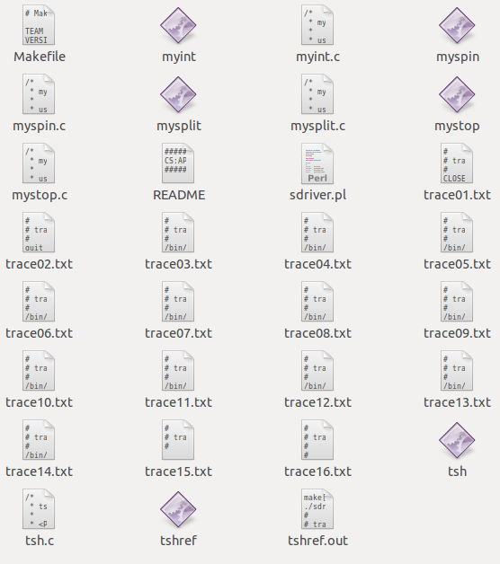

以上文件中，我们要实现的七个函数均在tsh.c中，tshref是参考文件。图中的txt文件均是测试文件。

## 4.实验内容及操作步骤

通过阅读实验指导书我们知道此实验要求我们完成tsh.c中的七个函数从而实现一个简单的shell，能够处理前后台运行程序、能够处理ctrl+z、ctrl+c等信号。

首先来了解一下tsh支持的四个内置命令：

- quit：命令终止tsh进程
- jobs：命令列出所有后台进程
- bg：命令会向作业发送SIGCNOT信号来重启job，并作为后台作业运行，参数可以是PID或JID
- fg：同上，唯一区别是job以前台作业运行

我们再来看一下tsh.c具体内容。

首先定义了一些宏

```C
/* 定义了一些宏 */
#define MAXLINE    1024   /* 一行中字符的最大数量 */
#define MAXARGS     128   /* 命令行中参数的最大数量 */
#define MAXJOBS      16   /* 序中同时存在的最大作业数量 */
#define MAXJID    1<<16   /* 作业ID的最大值 */
```

定义了四种进程状态

```C
/* 工作状态 */
#define UNDEF 0 /* undefined */
#define FG 1    /* 前台状态 */
#define BG 2    /* 后台状态 */
#define ST 3    /* 挂起状态 */
```

然后定义了job_t的任务的类，并且创建了jobs[]数组

```C
struct job_t {              /* The job struct */
    pid_t pid;              /* job PID */
    int jid;                /* job ID [1, 2, ...] */
    int state;              /* UNDEF, BG, FG, or ST */
    char cmdline[MAXLINE];  /* 命令行 */
};
struct job_t jobs[MAXJOBS]; /* The job list */
```

接着是需要我们完成的七个函数定义

```C
void eval(char *cmdline); 
/*
	分析命令，并派生子进程执行 主要功能是解析cmdline并运行
	具体流程：
		命令行解析后，eval函数会调用builtin_cmd函数
		builtin_cmd函数就会检查第一个命令行参数是否为内置的外壳命令
		如果是就立即解释执行该命令并返回1；反之则返回0
*/

int builtin_cmd(char **argv); //解析和执行bulidin命令，包括 quit, fg, bg, and jobs

void do_bgfg(char **argv); //执行bg和fg命令

void waitfg(pid_t pid); //实现阻塞等待前台程序运行结束

void sigchld_handler(int sig); //SIGCHID信号处理函数。唤醒父进程给子进程收尸，避免产生僵尸进程

void sigtstp_handler(int sig); //信号处理函数，响应 SIGINT (ctrl-c) 信号 

void sigint_handler(int sig); //信号处理函数，响应 SIGTSTP (ctrl-z) 信号
```

下面就是一些辅助的函数

```C
int parseline(const char *cmdline, char **argv);   //获取参数列表，返回是否为后台运行命令
void sigquit_handler(int sig);  //处理SIGQUIT信号
void clearjob(struct job_t *job);  //清除job结构体 
void initjobs(struct job_t *jobs);  //初始化任务jobs[]
int maxjid(struct job_t *jobs);   //返回jobs链表中最大的jid号。
int addjob(struct job_t *jobs, pid_t pid, int state, char *cmdline);  //向jobs[]添加一个任务
int deletejob(struct job_t *jobs, pid_t pid);   //在jobs[]中删除pid的job
pid_t fgpid(struct job_t *jobs);  //返回当前前台运行job的pid号
struct job_t *getjobpid(struct job_t *jobs, pid_t pid);  //根据pid找到对应的job 
struct job_t *getjobjid(struct job_t *jobs, int jid);   //根据jid找到对应的job 
int pid2jid(pid_t pid);   //根据pid找到jid 
void listjobs(struct job_t *jobs);  //打印jobs 
```

接着就是main函数，作用是在文件中逐行获取命令，并且判断是不是文件结束（EOF），将命令cmdline送入eval函数进行解析。我们需要做的就是逐步完善这个过程

### 注意事项

- tsh的提示符为`tsh>`
- 用户键入的命令行应包括命令名称和 0 个或多个参数，所有参数以一个或多个空格分隔。如果 name 是一个内置命令，则 tsh 应该立即处理它并等待下一个命令行。否则，tsh 假定该名称是一个可执行程序的路径，并在在一个初始子进程的上下文中加载并运行
- tsh不需要支持管道和重定向
- 如果用户输入`ctrl-c` (`ctrl-z`)，那么`SIGINT` (`SIGTSTP`)信号应该被送给每一个在前台进程组中的进程，如果没有进程，那么这两个信号应该不起作用。
- 如果一个命令以“&”结尾，那么tsh应该将它们放在后台运行，否则就放在前台运行（并等待它的结束）
- 每个作业都可以由一个进程 ID（PID）或一个作业 ID（JID）标识，该 ID 是一个由 tsh 分配的正整数。 JID应该在命令行上以前缀 “％” 表示。例如，“％5” 表示 JID 5，“ 5” 表示 PID 5
- tsh 应该支持以下内置命令：
  - jobs：列出所有后台作业
  - bg ：向作业发送 SIGCONT 信号来重新启动 ，然后在后台运行
  - fg ：向作业发送 SIGCONT 信号来重新启动 ，然后在前台运行
  - quit：终止 tsh 程序。
- tsh 必须回收所有的僵死进程

接下来开始实验：

1. 使用make命令编译tsh.c文件（文件有所改变的话需要先使用make clean指令清空）

```bash
szh@ubuntu:~/shlab-handout$ make
gcc -Wall -O2    tsh.c   -o tsh
gcc -Wall -O2    myspin.c   -o myspin
gcc -Wall -O2    mysplit.c   -o mysplit
gcc -Wall -O2    mystop.c   -o mystop
gcc -Wall -O2    myint.c   -o myint
```

2. 使用make testXX指令比较traceXX.txt文件在编写的shell和reference shell的运行结果；

接下来我们开始补充函数

3. 要运行您的shell，请在命令行中输入tsh：

   ```bash
   szh@ubuntu:~/shlab$ ./tsh
   tsh> [在此处输入您的shell命令]
   ```

### eval函数

**函数功能**：eval函数用于解析和解释命令行。eval首先解析命令行，如果用户请求一个内置命令quit、jobs、bg或fg（即内置命令）那么就立即执行。否则，fork子进程和在子进程的上下文中运行作业。如果作业正在运行前台，等待它终止，然后返回。

**函数原型**：void eval(char *cmdline)，传入的参数为cmdline，即命令行字符串

**实现思路**：仿照书上的eval函数写法和所需的功能来完成函数

1. 首先调用parseline函数解析命令行，如果为空直接返回，接着使用builtin_cmd函数判断是否为内置命令，返回0说明不是内置命令，如果是内置命令直接执行。
2. 如果不是内置命令，那么先阻塞信号（具体在第四点分析），再调用fork创建子进程。在子进程中，首先解除阻塞，设置自己的id号，然后调用execve函数来执行job。
3. 父进程判断作业是否后台运行，是的话调用addjob函数将子进程job加入job链表中，解除阻塞，然后调用waifg函数等待前台运行完成。如果不在后台工作则打印进程组jid和子进程pid以及命令行字符串。
4. 因为子进程继承了他们父进程的阻塞向量，所以在执行新程序之前，子程序必须确保解除对SIGCHLD信号的阻塞。父进程必须使用sigprocmask在它派生子进程之前也就是调用fork函数之前阻塞SIGCHLD信号，之后解除阻塞；在通过调用addjob将子进程添加到作业列表之后，再次使用sigprocmask，解除阻塞。

完整代码：

```C
void eval(char *cmdline)
{
    char* argv[MAXARGS];   //存放解析的参数
    int state = UNDEF;  //工作状态，FG或BG 
    sigset_t set;
    pid_t pid;  //进程id
    // 处理输入的数据
    if(parseline(cmdline, argv) == 1)  //解析命令行，将解析后的参数存储在argv数组中
        state = BG;
    else
        state = FG;
    if(argv[0] == NULL)  //命令行为空直接返回
        return;
    // 如果不是内置命令
    if(!builtin_cmd(argv))
    {
        if(sigemptyset(&set) < 0)
            unix_error("sigemptyset error");
        if(sigaddset(&set, SIGINT) < 0 || sigaddset(&set, SIGTSTP) < 0 || sigaddset(&set, SIGCHLD) < 0)
            unix_error("sigaddset error");
        //在它派生子进程之前阻塞SIGCHLD信号，防止竞争 
        if(sigprocmask(SIG_BLOCK, &set, NULL) < 0)
            unix_error("sigprocmask error");

        if((pid = fork()) < 0)  //fork创建子进程失败 
            unix_error("fork error");
        else if(pid == 0)  //fork创建子进程
        {
            // 子进程的控制流开始
            if(sigprocmask(SIG_UNBLOCK, &set, NULL) < 0)  //解除阻塞
                unix_error("sigprocmask error");
            if(setpgid(0, 0) < 0)  //设置子进程id 
                unix_error("setpgid error");
            if(execve(argv[0], argv, environ) < 0){
                printf("%s: command not found\n", argv[0]);
                exit(0);
            }
        }
        // 将当前进程添加进job中，无论是前台进程还是后台进程
        addjob(jobs, pid, state, cmdline);
        // 恢复受阻塞的信号 SIGINT SIGTSTP SIGCHLD
        if(sigprocmask(SIG_UNBLOCK, &set, NULL) < 0)
            unix_error("sigprocmask error");

        // 判断子进程类型并做处理
        if(state == FG)
            waitfg(pid);  //前台作业等待
        else
            printf("[%d] (%d) %s", pid2jid(pid), pid, cmdline);  //将进程id映射到job id 
    }
    return;
}
```

注意：

1. 每个子进程必须有自己独一无二的进程组id，通过在fork()之后的子进程中Setpgid(0,0)实现，这样当向前台程序发送ctrl+c或ctrl+z命令时，才不会影响到后台程序。如果没有这一步，则所有的子进程与当前的tsh shell进程为同一个进程组，发送信号时，前后台的子进程均会收到。
2. 在fork()新进程前要阻塞SIGCHLD信号，防止出现竞争，这是经典的同步错误，如果不阻塞会出现子进程先结束从jobs中删除，然后再执行到主进程addjob的竞争问题。

### builtin_cmd函数

**函数功能**：识别并执行内置命令: quit, fg, bg, 和 jobs。

**函数原型**：int builtin_cmd(char **argv)，参数为argv 参数列表

**实现思路**：

1. 当命令行参数为quit时，直接终止shell
2. 当命令行参数为jobs时，调用listjobs函数，显示job列表
3. 当命令行参数为bg或fg时，调用do_bgfg函数，执行内置的bg和fg命令
4. 不是内置命令时返回0

完整代码：

```C
int builtin_cmd(char **argv)
{
    if(!strcmp(argv[0], "quit"))  //如果命令是quit，退出
        exit(0);
    else if(!strcmp(argv[0], "bg") || !strcmp(argv[0], "fg"))  //如果是bg或者fg命令，执行do_fgbg函数 
        do_bgfg(argv);
    else if(!strcmp(argv[0], "jobs"))  //如果命令是jobs，列出正在运行和停止的后台作业
        listjobs(jobs);
    else
        return 0;     /* 不是内置命令 */
    return 1;
}
```

### do_bgfg函数

**函数功能**：实现内置命令bg 和 fg

首先要明确的是bg和bg的作用

> `bg <job>`:将停止的后台作业更改为正在运行的后台作业。通过发送SIGCONT信号重新启动`<job>`，然后在后台运行它。`<job>`参数可以是PID，也可以是JID。ST -> BG
>
> `fg <job>`:将已停止或正在运行的后台作业更改为前台正在运行的作业。通过发送SIGCONT信号重新启`<job>`，然后在前台运行它。`<job>`参数可以是PID，也可以是JID。ST -> FG，BG -> FG

**函数原型**：void do_bgfg(char **argv)，参数为argv 参数列表

**实现思路**：

1. 判断argv[]是否带%，若为整数则传入pid，若带%则传入jid。接着调用getjobjid函数来获得对应的job结构体，如果返回为空，说明列表中并不存在jid的job，要输出提示。

2. 使用strcmp函数判断是bg命令还是fg命令
   - 若是bg，使目标进程重新开始工作，设置状态为BG(后台)，打印进程信息
   - 若是fg，使目标进程重新开始工作，设置状态为FG(前台)，等待进程结束

完整代码：

```C
void do_bgfg(char **argv)
{
    int num;
    struct job_t *job;
    // 没有参数的fg/bg应该被丢弃
    if(!argv[1]){  //命令行为空
        printf("%s command requires PID or %%jobid argument\n", argv[0]);
        return ;
    }
    // 检测fg/bg参数，其中%开头的数字是JobID，纯数字的是PID
    if(argv[1][0] == '%'){  //解析jid
        if((num = strtol(&argv[1][1], NULL, 10)) <= 0){
            printf("%s: argument must be a PID or %%jobid\n",argv[0]);//失败,打印错误消息
            return;
        }
        if((job = getjobjid(jobs, num)) == NULL){
            printf("%%%d: No such job\n", num); //没找到对应的job 
            return;
        }
    } 
    else {
        if((num = strtol(argv[1], NULL, 10)) <= 0){
            printf("%s: argument must be a PID or %%jobid\n",argv[0]);//失败,打印错误消息
            return;
        }
        if((job = getjobpid(jobs, num)) == NULL){
            printf("(%d): No such process\n", num);  //没找到对应的进程 
            return;
        }
    }

    if(!strcmp(argv[0], "bg")){
        // bg会启动子进程，并将其放置于后台执行
        job->state = BG;  //设置状态 
        if(kill(-job->pid, SIGCONT) < 0)  //采用负数发送信号到进程组 
            unix_error("kill error");
        printf("[%d] (%d) %s", job->jid, job->pid, job->cmdline);
    } 
    else if(!strcmp(argv[0], "fg")) {
        job->state = FG;  //设置状态 
        if(kill(-job->pid, SIGCONT) < 0)  //采用负数发送信号到进程组 
            unix_error("kill error");
        // 当一个进程被设置为前台执行时，当前tsh应该等待该子进程结束
        waitfg(job->pid);
    } 
    else {
        puts("do_bgfg: Internal error");
        exit(0);
    }
    return;
}
```

### waitfg函数

**函数功能**：等待一个前台作业结束，或者说是阻塞一个前台的进程直到这个进程变为后台进程

**函数原型**：void waitfg(pid_t pid) ，参数为进程ID

**实现思路**：判断当前的前台的进程组pid是否和当前进程的pid是否相等，如果相等则sleep直到前台进程结束。

完整代码：

```C
void waitfg(pid_t pid)
{
    struct job_t *job = getjobpid(jobs, pid);
    if(!job) return;

    // 如果当前子进程的状态没有发生改变，则tsh继续休眠
    while(job->state == FG)
        sleep(1);
    return;
}
```

### sigchld_handler函数

**函数功能**：处理SIGCHILD信号

**函数原型**：void sigchld_handler(int sig)，参数为信号类型

首先了解一下父进程回收子进程的过程：当一个子进程终止或者停止时，内核会发送一个SIGCHLD信号给父进程。因此父进程必须回收子进程，以避免在系统中留下僵死进程。父进程捕获这个SIGCHLD信号，回收一个子进程。一个进程可以通过调用 waitpid 函数来等待它的子进程终止或者停止。如果回收成功，则返回为子进程的 PID, 如果 WNOHANG, 则返回为 0, 如果其他错误，则为 -1。

**实现思路**：

- 用while循环调用waitpid直到它所有的子进程终止。

- 检查己回收子进程的退出状态

  - WIFSTOPPED：：引起返回的子进程当前是被停止的

  - WIFSIGNALED：子进程是因为一个未被捕获的信号终止

  - WIFEXITED：子进程通过调用exit 或者return正常终止

- 然后分别用WSTOPSIG，WTERMSIG，WEXITSTATUS提取以上三个退出状态。注意如果引起返回的子进程当前是被停止的进程，那么要将其状态设置为ST

完整代码：

```C
void sigchld_handler(int sig)
{
    int status, jid;
    pid_t pid;
    struct job_t *job;

    if(verbose)
        puts("sigchld_handler: entering");

    /*
    以非阻塞方式等待所有子进程
    waitpid 参数3：
        1.     0     ： 执行waitpid时， 只有在子进程 **终止** 时才会返回。
        2. WNOHANG   : 若子进程仍然在运行，则返回0 。
                注意只有设置了这个标志，waitpid才有可能返回0
        3. WUNTRACED : 如果子进程由于传递信号而停止，则马上返回。
                只有设置了这个标志，waitpid返回时，其WIFSTOPPED(status)才有可能返回true
    */
    while((pid = waitpid(-1, &status, WNOHANG | WUNTRACED)) > 0){

        // 如果当前这个子进程的job已经删除了，则表示有错误发生
        if((job = getjobpid(jobs, pid)) == NULL){
            printf("Lost track of (%d)\n", pid);
            return;
        }
        jid = job->jid;
        
        //接下来判断三种状态 
        // 如果这个子进程收到了一个暂停信号（还没退出） 
        if(WIFSTOPPED(status)){
            printf("Job [%d] (%d) stopped by signal %d\n", jid, job->pid, WSTOPSIG(status));
            job->state = ST;  //状态设为挂起 
        }
        // 如果子进程通过调用 exit 或者一个返回 (return) 正常终止
        else if(WIFEXITED(status)){
            if(deletejob(jobs, pid))
                if(verbose){
                    printf("sigchld_handler: Job [%d] (%d) deleted\n", jid, pid);
                    printf("sigchld_handler: Job [%d] (%d) terminates OK (status %d)\n", jid, pid, WEXITSTATUS(status));
                }
        }
        // 如果子进程是因为一个未被捕获的信号终止的，例如SIGKILL
        else {
            if(deletejob(jobs, pid)){  //清除进程
                if(verbose)
                    printf("sigchld_handler: Job [%d] (%d) deleted\n", jid, pid);
            }
            printf("Job [%d] (%d) terminated by signal %d\n", jid, pid, WTERMSIG(status));  //返回导致子进程终止的信号的数量
        }
    }

    if(verbose)
        puts("sigchld_handler: exiting");

    return;
}
```

### sigint_handler函数

**函数功能**：捕获SIGINT信号

**函数原型**：void sigchld_handler(int sig)，参数为信号类型

**实现思路**：

1. 调用函数fgpid返回前台进程pid
2. 如果当前进程pid不为0，那么调用kill函数发送SIGINT信号给前台进程组
3. 在2中调用kill函数如果返回值为-1表示进程不存在。输出error

完整代码：

```C
void sigint_handler(int sig)
{
    if(verbose)
        puts("sigint_handler: entering");
    pid_t pid = fgpid(jobs);

    if(pid){
        // 发送SIGINT给前台进程组里的所有进程
        // 需要注意的是，前台进程组内的进程除了当前前台进程以外，还包括前台进程的子进程。
        // 最多只能存在一个前台进程，但前台进程组内可以存在多个进程
        if(kill(-pid, SIGINT) < 0)
            unix_error("kill (sigint) error");
        if(verbose){
            printf("sigint_handler: Job (%d) killed\n", pid);
        }
    }
    if(verbose)
        puts("sigint_handler: exiting");
    return;
}
```

### sigtstp_handler函数

**函数功能**：同sigint_handler差不多，捕获SIGTSTP信号

**函数原型**：void sigtstp_handler(int sig) ，参数为信号类型

首先了解一下SIGTSTP的作用：SIGTSPT信号默认行为是停止直到下一个 SIGCONT，是来自终端的停止信号，在键盘上输入 CTR+Z会导致一个 SIGTSPT信号被发送到外壳。外壳捕获该信号，然后发送SIGTSPT信号到这个前台进程组中的每个进程。在默认情况下，结果是停止或挂起前台作业。

**实现思路**：

1. 用fgpid(jobs)获取前台进程pid，判断当前是否有前台进程，如果没有直接返回。
2. 用kill(-pid,sig)函数发送SIGTSPT信号给前台进程组。

完整代码：

```C
void sigtstp_handler(int sig)
{
    if(verbose)
        puts("sigstp_handler: entering");

    pid_t pid = fgpid(jobs);
    struct job_t *job = getjobpid(jobs, pid);

    if(pid){
        if(kill(-pid, SIGTSTP) < 0)
            unix_error("kill (tstp) error");
        if(verbose){
            printf("sigstp_handler: Job [%d] (%d) stopped\n", job->jid, pid);
        }
    }
    if(verbose)
        puts("sigstp_handler: exiting");
    return;
}
```

注意：使用kill函数，如果 pid 小于零才会发送信号sig 给进程组中的每个进程，因此这里使用-pid。

至此tsh.c文件完成。

接下来我们分析以下测试文件的内容并看下我们的函数能否完成测试

首先了解一下一些测试文件的符号和命令的定义：

**符号**：

- 空格：分隔指令作用

- &：如果命令以&结尾，表示标该作业在后台运行
- #：直接打印#后一行的文本内容
- %：后接一个整数，表示job的ID号。

**命令**：

- jobs: 列出正在运行和停止的后台作业
- bg <job>: 将停止的后台作业更改为正在运行的后台作业
- fg <job>:将已停止或正在运行的后台作业更改为前台正在运行的作业
- kill : 终止一个作业

**用户程序**：

- myint程序：函数睡眠，使程序睡眠n秒，运行结束后不会自动退出，并会检测系统错误；
- myspin程序：函数睡眠，使程序睡眠n秒，在睡眠结束后就自动退出，不检测系统错误；
- mysplit程序：函数睡眠，使程序睡眠n秒，创建一个子进程进行睡眠，然后父进程等待子进程正常睡眠n秒后，继续运行；
- mystop程序：让进程暂定n秒，并发送信号。

### 备注

1. `sigemptyset` 是一个 POSIX 标准的函数，用于初始化一个空的信号集。

   ```c
   int sigemptyset(sigset_t *set);
   ```

   - 函数原型：`int sigemptyset(sigset_t *set);`
   - 功能：将信号集 `set` 清空，即将其中的所有信号移除。
   - 参数 `set`：指向要操作的信号集的指针。
   - 返回值：如果成功，返回 0；如果失败，返回 -1。

2. `sigset_t` 是一个数据类型，用于表示信号集。在 C 语言中，它通常是一个整数或整数数组的类型别名，用于在底层操作系统中管理信号的集合。

   通过声明 `sigset_t set;`，创建了一个名为 `set` 的变量，可以用于存储和操作信号集。具体的信号操作函数（如 `sigemptyset`、`sigaddset`、`sigdelset` 等）可以用于对 `set` 进行初始化、添加或删除信号等操作。

3. `sigaddset` 是一个 POSIX 标准的函数，用于向信号集中添加一个或多个信号。

   ```C
   int sigaddset(sigset_t *set, int signum);
   ```

   - 函数原型：`int sigaddset(sigset_t *set, int signum);`
   - 功能：将信号 `signum` 添加到信号集 `set` 中。
   - 参数 `set`：指向要操作的信号集的指针。
   - 参数 `signum`：要添加到信号集的信号编号。
   - 返回值：如果成功，返回 0；如果失败，返回 -1。

4. `sigprocmask` 是一个 POSIX 标准的函数，用于修改进程的信号屏蔽字（signal mask）。

   ```C
   int sigprocmask(int how, const sigset_t *set, sigset_t *oldset);
   ```

   - 函数原型：`int sigprocmask(int how, const sigset_t *set, sigset_t *oldset);`
   - 功能：根据参数 `how` 指定的方式修改进程的信号屏蔽字。
   - 参数 `how`：指定信号屏蔽字的修改方式，可以是以下值之一：
     - `SIG_BLOCK`：将 `set` 中的信号添加到当前的信号屏蔽字中。
     - `SIG_UNBLOCK`：从当前的信号屏蔽字中移除 `set` 中的信号。
     - `SIG_SETMASK`：将当前的信号屏蔽字设置为 `set` 中的值。
   - 参数 `set`：指向要设置的新信号屏蔽字的指针。
   - 参数 `oldset`：如果不为 `NULL`，则存储之前的信号屏蔽字。
   - 返回值：如果成功，返回 0；如果失败，返回 -1。

5. `strtol` 是一个标准库函数，用于将字符串转换为长整型数值。

   ```C
   long strtol(const char *str, char **endptr, int base);
   ```

   - 函数原型：`long strtol(const char *str, char **endptr, int base);`
   - 功能：将字符串 `str` 转换为长整型数值。
   - 参数 `str`：要进行转换的字符串。
   - 参数 `endptr`：如果不为 `NULL`，则用于存储转换结束后的字符指针。
   - 参数 `base`：转换时使用的进制数，可以是 2~36 之间的值，或者是特殊值 0。
   - 返回值：转换后的长整型数值。

6. `setpgid()`是一个系统调用函数，用于设置一个进程的进程组ID（Process Group ID）。进程组是一组具有相同进程组ID的进程的集合，用于实现进程之间的协作和控制。

   函数原型如下：

   ```C
   int setpgid(pid_t pid, pid_t pgid);
   ```

   参数说明：

   - `pid`：要设置的进程的进程ID（PID）。
   - `pgid`：要设置的进程组的进程组ID（PGID）。

   函数功能：

   - 如果`pid`参数为0，则将当前进程的进程ID设置为`pgid`参数指定的进程组ID，即将当前进程放入指定的进程组中。
   - 如果`pid`参数非零，则将`pid`指定的进程的进程组ID设置为`pgid`参数指定的进程组ID，即将指定进程移动到指定的进程组中。

## 5.测试

### 第一关-正确地终止EOF

首先打开 trace01.txt查看文件内容

```bash
#
# trace01.txt - Properly terminate on EOF.
#
CLOSE
WAIT
```

\#可以理解为//，不需要我们解析。第一关调用了linux命令close关闭文件并wait等待，在EOF上正常终止，所以不需要我们做任何事

输入`make test01`和`make rtest01`查看运行结果

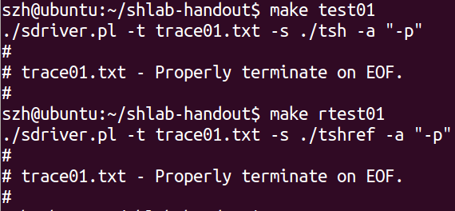

tsh实验现象和tshref一致，结果正确

### 第二关-进程内置quit命令

打开 trace02.txt查看文件内容

```bash
#
# trace02.txt - Process builtin quit command.
#
quit
WAIT
```

第二关需要我们针对输入的命令quit退出shell进程，我们需要解析cmdline（输入的命令），判断是不是“quit”字符串，是就退出。

输入`make test02`和`make rtest02`查看运行结果

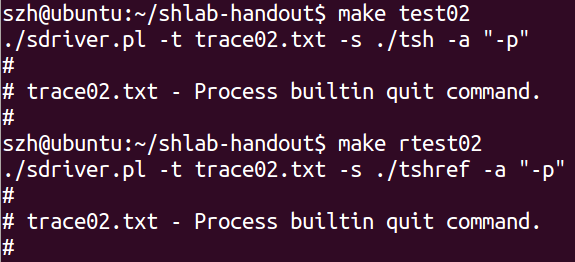

tsh实验现象和tshref一致，结果正确

### 第三关-运行一个前台job

打开 trace03.txt查看文件内容

```bash
#
# trace03.txt - Run a foreground job.
#
/bin/echo tsh> quit
quit
```

这里解释一下/bin/echo：

eval函数先通过builtin_cmd查询cmdline是不是内置命令如quit，如果是则当前进程执行命令

如果不是则创建一个子进程，在子进程中调用 execve()函数通过 argv[0]来寻找路径，并在子进程中运行路径中的可执行文件，如果找不到则说明命令为无效命令，输出命令无效，并用 exit(0)结束该子进程

/bin/echo就是打开bin目录下的echo文件，echo可以理解为将其后面的内容当作字符串输出

所以第三关的任务是：

- 首先是/bin/echo tsh> quit 意思是打开 bin 目录下的 echo 可执行文件，在 foregound 开启一个子进程运行它（因为末尾没有&符号，如果有，就是在 backgound 运行）
- 运行 echo 这个进程的过程中，通过 tsh>quit 命令，调用 tsh并执行内置命令 quit，退出 echo 这个子进程
- 最后在 tsh 中执行内置命令 quit，退出 tsh 进程，回到我们的终端。

输入`make test03`和`make rtest03`查看运行结果

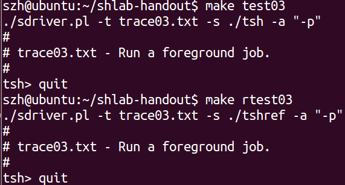

tsh实验现象和tshref一致，结果正确

### 第四关-运行后台job

打开 trace04.txt查看文件内容

```bash
#
# trace04.txt - Run a background job.
#
/bin/echo -e tsh> ./myspin 1 \046
./myspin 1 &
```

先在前台执行echo命令，等待程序执行完毕回收子进程。&代表是一个后台程序，myspin睡眠1秒，然后停止。因为在后台，所以显示下面一句，如果在前台则无。

输入`make test04`和`make rtest04`查看运行结果

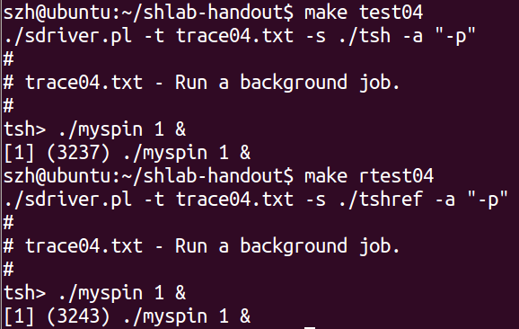

tsh实验现象和tshref一致，结果正确

### 第五关-处理jobs内置命令

打开 trace05.txt查看文件内容

```bash
#
# trace05.txt - Process jobs builtin command.
#
/bin/echo -e tsh> ./myspin 2 \046
./myspin 2 &

/bin/echo -e tsh> ./myspin 3 \046
./myspin 3 &

/bin/echo tsh> jobs
jobs
```

分别运行了前台echo、后台myspin、前台echo、后台myspin，然后需要实现一个内置命令job，功能是显示目前任务列表中的所有任务的所有属性

输入`make test05`和`make rtest05`查看运行结果

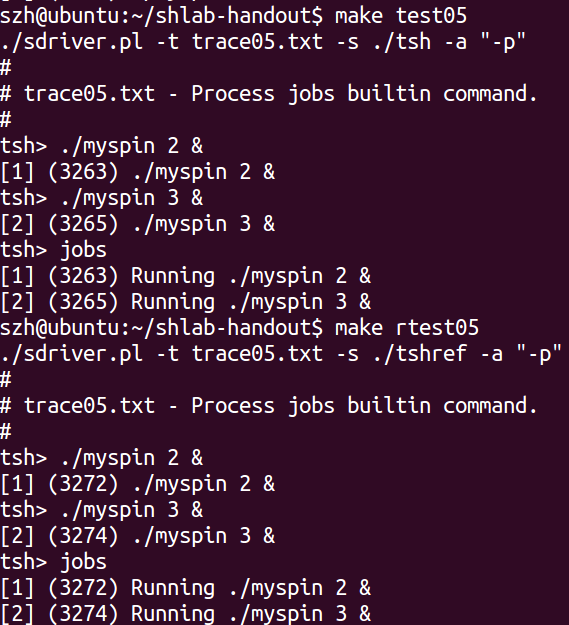

tsh实验现象和tshref一致，结果正确

### 第六关-将SIGINT转发到前台作业

打开 trace06.txt查看文件内容

```bash
#
# trace06.txt - Forward SIGINT to foreground job.
#
/bin/echo -e tsh> ./myspin 4
./myspin 4 

SLEEP 2
INT
```

接收到了中断信号SIGINT（即CTRL_C)那么结束前台进程

输入`make test06`和`make rtest06`查看运行结果

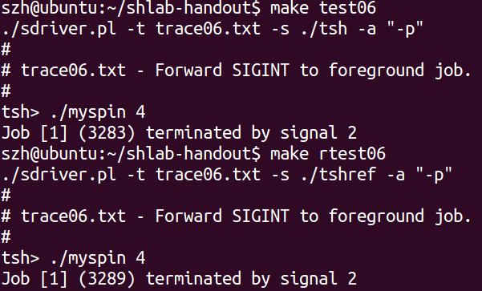

tsh实验现象和tshref一致，结果正确

### 第七关-仅将SIGINT转发给前台作业

打开 trace07.txt查看文件内容

```bash
#
# trace07.txt - Forward SIGINT only to foreground job.
#
/bin/echo -e tsh> ./myspin 4 \046
./myspin 4 &

/bin/echo -e tsh> ./myspin 5
./myspin 5 

SLEEP 2
INT

/bin/echo tsh> jobs
jobs
```

根据注释，我们可以知道第七关测试的是只将SIGINT转发给前台作业。这里的命令行其实根据前面的就很好理解了，就是给出两个作业，一个在前台工作，另一个在后台工作，接下来传递SIGINT指令，然后调用内置指令jobs来查看此时的工作信息，来对比出是不是只将SIGINT转发给前台作业。

输入`make test07`和`make rtest07`查看运行结果
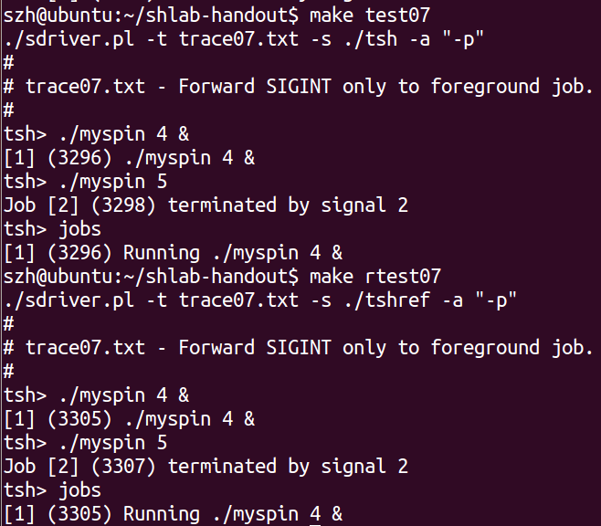

tsh实验现象和tshref一致，结果正确

### 第八关-仅将SIGTSTP转发到前台作业

打开 trace08.txt查看文件内容

```bash
#
# trace08.txt - Forward SIGTSTP only to foreground job.
#
/bin/echo -e tsh> ./myspin 4 \046
./myspin 4 &

/bin/echo -e tsh> ./myspin 5
./myspin 5 

SLEEP 2
TSTP

/bin/echo tsh> jobs
jobs
```

根据注释我们是需要将SIGTSTP转发给前台作业。根据这个信号的作用，也就是该进程会停止直到下一个SIGCONT也就是挂起，让别的程序继续运行。这里也就是运行了后台程序，然后使用jobs来打印出进程的信息。

输入`make test08`和`make rtest08`查看运行结果

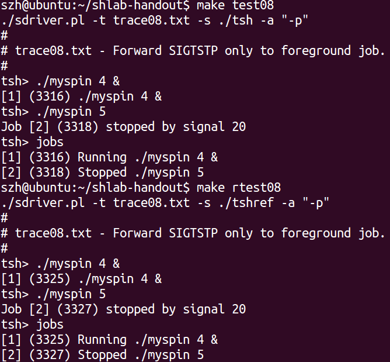

tsh实验现象和tshref一致，结果正确

### 第九关-进程bg内置命令

打开 trace09.txt查看文件内容

```bash
#
# trace09.txt - Process bg builtin command
#
/bin/echo -e tsh> ./myspin 4 \046
./myspin 4 &

/bin/echo -e tsh> ./myspin 5
./myspin 5 

SLEEP 2
TSTP

/bin/echo tsh> jobs
jobs

/bin/echo tsh> bg %2
bg %2

/bin/echo tsh> jobs
jobs
```

这里是在第八关的测试文件之上的一个更加完整的测试，这里也就是在停止后，输出进程信息之后，使用bg命令来唤醒进程2，也就是刚才被挂起的程序，接下来继续使用Jobs命令来输出结果。

输入`make test09`和`make rtest09`查看运行结果

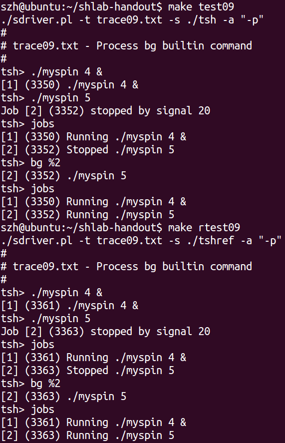

tsh实验现象和tshref一致，结果正确

### 第十关-进程fg内置命令

打开 trace10.txt查看文件内容

```bash
#
# trace10.txt - Process fg builtin command. 
#
/bin/echo -e tsh> ./myspin 4 \046
./myspin 4 &

SLEEP 1
/bin/echo tsh> fg %1
fg %1

SLEEP 1
TSTP

/bin/echo tsh> jobs
jobs

/bin/echo tsh> fg %1
fg %1

/bin/echo tsh> jobs
jobs
```

这里是将后台的进程更改为前台正在运行的程序。测试文中进程1根据&可以知道，进程1是一个后台进程。先使用fg命令将其转化为前台的一个程序，接下来停止进程1，然后打印出进程信息，这时候进程1应该是前台程序同时被挂起了，接下来使用fg命令使其继续运行，使用jobs来打印出进程信息

输入`make test10`和`make rtest10`查看运行结果
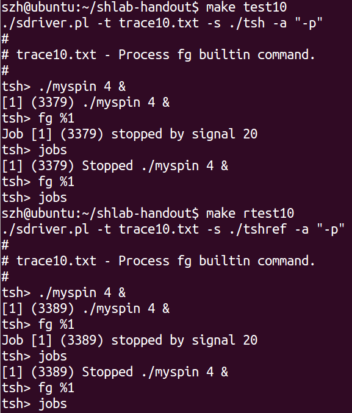

tsh实验现象和tshref一致，结果正确

### 第十一关-将SIGINT转发给前台进程组中的每个进程

打开 trace11.txt查看文件内容

```bash
#
# trace11.txt - Forward SIGINT to every process in foreground process group
#
/bin/echo -e tsh> ./mysplit 4
./mysplit 4 

SLEEP 2
INT

/bin/echo tsh> /bin/ps a
/bin/ps a
```

根据注释我们可以知道这里需要将SIGINT发给前台进程组中的每个进程。ps –a 显示所有进程，这里是有两个进程的，mysplit创建了一个子进程，接下来发送指令SIGINT，所以进程组中的所有进程都应该停止，接下来调用pl来查看该进程组中的每个进程是否都停止了。

输入`make test11`和`make rtest11`查看运行结果
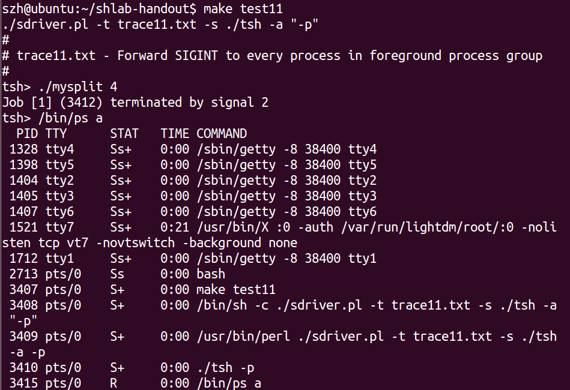

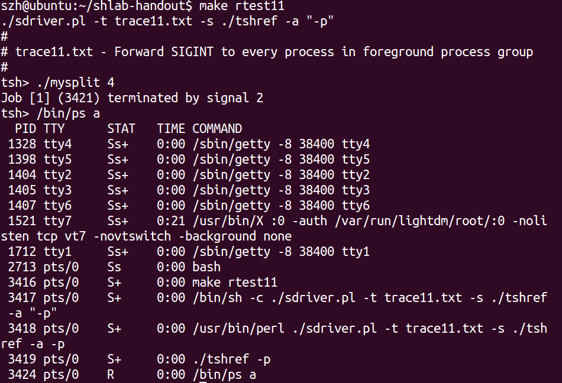

tsh实验现象和tshref一致，结果正确

### 第十二关-将SIGTSTP转发到前台进程组中的每个进程

打开 trace12.txt查看文件内容

```bash
#
# trace12.txt - Forward SIGTSTP to every process in foreground process group
#
/bin/echo -e tsh> ./mysplit 4
./mysplit 4 

SLEEP 2
TSTP

/bin/echo tsh> jobs
jobs

/bin/echo tsh> /bin/ps a
/bin/ps a
```

根据注释可知该测试程序是为了测试将SIGTSTP转发给前台进程组中的每个进程。与上一关相同，只需要相应的进程被挂起即可。

输入`make test12`和`make rtest12`查看运行结果

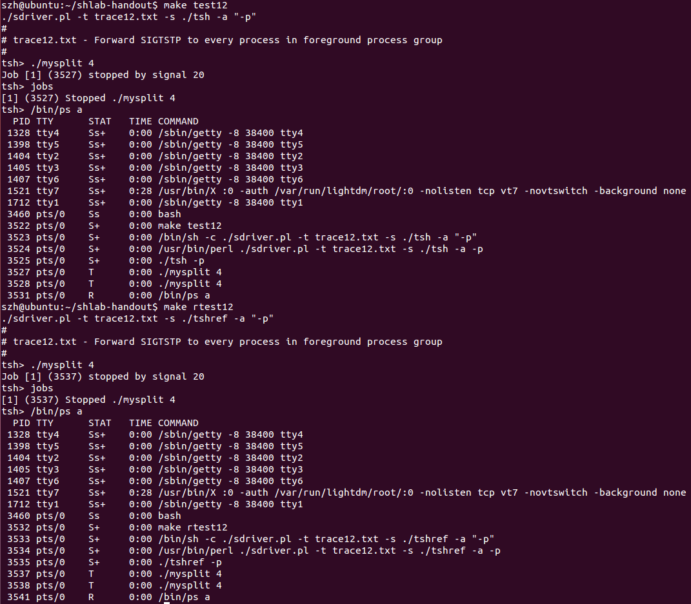

tsh实验现象和tshref一致，结果正确

### 第十三关-重新启动进程组中的每个已停止的进程

打开 trace13.txt查看文件内容

```bash
#
# trace13.txt - Restart every stopped process in process group
#
/bin/echo -e tsh> ./mysplit 4
./mysplit 4 

SLEEP 2
TSTP

/bin/echo tsh> jobs
jobs

/bin/echo tsh> /bin/ps a
/bin/ps a

/bin/echo tsh> fg %1
fg %1

/bin/echo tsh> /bin/ps a
/bin/ps a
```

根据注释我们可以知道该程序是为了测试重新启动进程组中的每个停止的进程。这里也就是使用fg来唤醒整个工作，中间使用ps -a来查看停止整个工作和唤醒整个工作的区别。

输入`make test13`和`make rtest13`查看运行结果

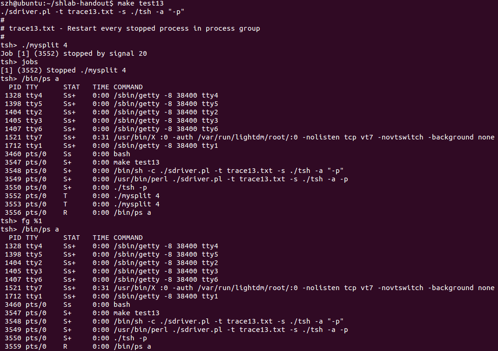

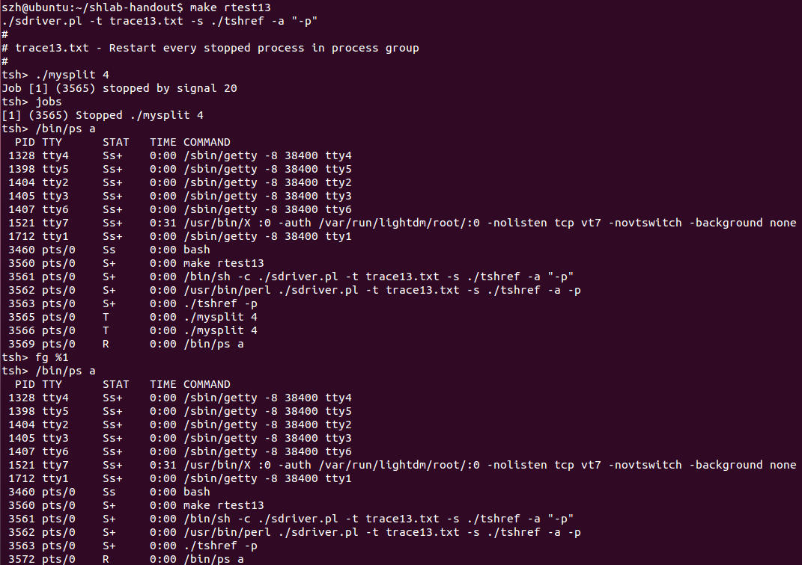

tsh实验现象和tshref一致，结果正确

### 第十四关-简单的错误处理

打开 trace14.txt查看文件内容

```bash
#
# trace14.txt - Simple error handling
#
/bin/echo tsh> ./bogus
./bogus

/bin/echo -e tsh> ./myspin 4 \046
./myspin 4 &

/bin/echo tsh> fg
fg

/bin/echo tsh> bg
bg

/bin/echo tsh> fg a
fg a

/bin/echo tsh> bg a
bg a

/bin/echo tsh> fg 9999999
fg 9999999

/bin/echo tsh> bg 9999999
bg 9999999

/bin/echo tsh> fg %2
fg %2

/bin/echo tsh> fg %1
fg %1

SLEEP 2
TSTP

/bin/echo tsh> bg %2
bg %2

/bin/echo tsh> bg %1
bg %1

/bin/echo tsh> jobs
jobs
```

根据注释可以知道这个文件是为了测试简单的错误处理。这里的测试文件，也就是测试fg和bg后面的参数，我们知道fg和bg后面需要一个JID或者是PID，其中JID是加上%的整型数。其余参数都应该报错，或是没有参数也应该报错。接下来测试的功能，都在上面的关卡测试过了

输入`make test14`和`make rtest14`查看运行结果
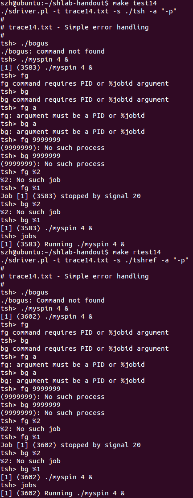

tsh实验现象和tshref一致，结果正确

### 第十五关-把它们放在一起

打开 trace15.txt查看文件内容

```bash
#
# trace15.txt - Putting it all together
#

/bin/echo tsh> ./bogus
./bogus

/bin/echo tsh> ./myspin 10
./myspin 10

SLEEP 2
INT

/bin/echo -e tsh> ./myspin 3 \046
./myspin 3 &

/bin/echo -e tsh> ./myspin 4 \046
./myspin 4 &

/bin/echo tsh> jobs
jobs

/bin/echo tsh> fg %1
fg %1

SLEEP 2
TSTP

/bin/echo tsh> jobs
jobs

/bin/echo tsh> bg %3
bg %3

/bin/echo tsh> bg %1
bg %1

/bin/echo tsh> jobs
jobs

/bin/echo tsh> fg %1
fg %1

/bin/echo tsh> quit
quit
```

根据注释这个测试文件测试的是把它们放在一起。本来还纳闷放在一起是什么意思呢？仔细阅读测试文件，可以知道他是测试了上述所有命令，如jobs,fg,bg,quit。

输入`make test15`和`make rtest15`查看运行结果

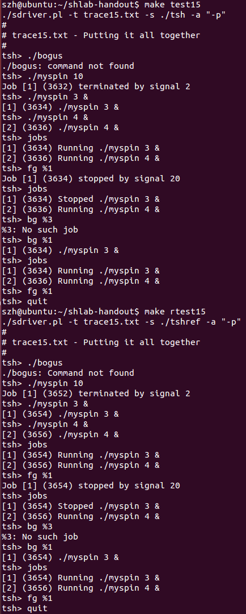

tsh实验现象和tshref一致，结果正确

### 第十六关-测试shell是否能够处理来自其他进程而不是终端的SIGTSTP和SIGINT信号

打开 trace16.txt查看文件内容

```bash
#
# trace16.txt - Tests whether the shell can handle SIGTSTP and SIGINT
#     signals that come from other processes instead of the terminal.
#

/bin/echo tsh> ./mystop 2 
./mystop 2

SLEEP 3

/bin/echo tsh> jobs
jobs

/bin/echo tsh> ./myint 2 
./myint 2
```

这个测试文件的具体含义就是，用户程序向job 2传送了中止信号，所以最后会输出进程2被中止的信息。同时，mystop需要自己停止才能给别的进程发送信号，所以中间也会出现进程1被中止的信息

输入`make test16`和`make rtest16`查看运行结果

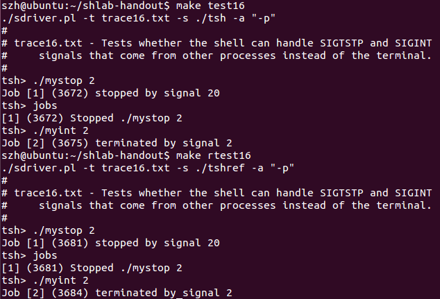

tsh实验现象和tshref一致，结果正确

十六关全部测试正确。
